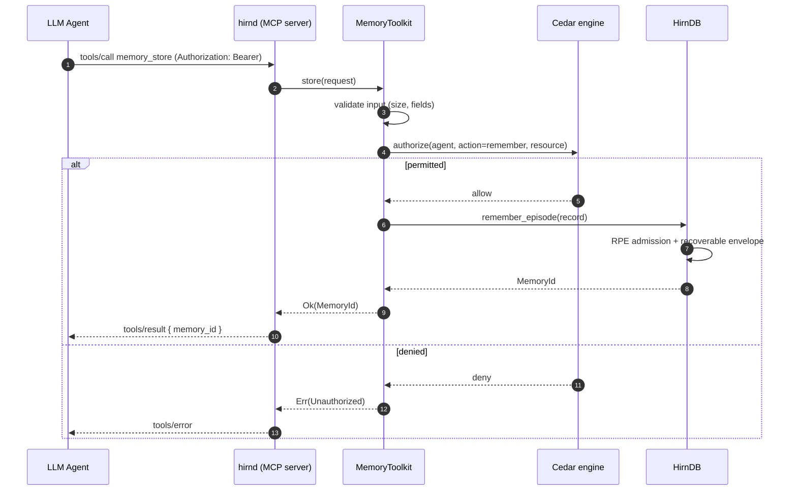

# Agent Tools
{: .no_toc }

This project is under active development. APIs, on-disk formats, and behaviour may change without notice. Not recommended for production use.
{: .experimental }

Hirn exposes a 6-function **MemoryToolkit** for AI agents to self-manage cognitive memory, plus a **MemoryAgent** for autonomous background maintenance. Both are available via MCP and gRPC.

## Table of contents
{: .no_toc .text-delta }

1. TOC
{:toc}

## How an Agent Drives hirn

The MemoryToolkit is deliberately small — six verbs an LLM can reason about
without a manual — but every call still passes through the full engine: input
validation, Cedar authorization keyed on the caller's agent identity, and
delegation to `HirnDB`. The same six functions are surfaced over two transports
(MCP for tool-using LLM clients, gRPC for services), so the identity and
authorization story is identical regardless of how the agent connects.

The sequence below traces one `memory_store` call from an MCP client through to
a durable write. Authorization happens *before* any mutation, and the write
itself follows the [recoverable-envelope contract](write-guarantees.md) so a
crash mid-store cannot strand a half-applied memory.



{: .note }
> Over MCP the agent identity comes from the per-request `Authorization:
> Bearer` credential (API key or JWT) — tool arguments can never assert an
> identity; over gRPC it travels in the `x-agent-id` metadata header of an
> authenticated connection. Either way, Cedar sees the same principal and the
> same action.

## MemoryToolkit — 7 Functions

Every function validates input, enforces Cedar authorization via the caller's agent identity, and delegates to `HirnDB`.

### 1. `store` — Store a new memory

Stores an episodic memory with RPE-gated admission.

| Parameter      | Type              | Required | Description |
|----------------|-------------------|----------|-------------|
| `content`      | `String`          | Yes      | Memory content (1 B – 1 MB) |
| `event_type`   | `EventType`       | No       | `Conversation`, `ToolCall`, `Observation`, `Experiment`, `Error`, `Decision` (default: `Observation`) |
| `importance`   | `f32`             | No       | Override importance score, 0.0–1.0 |
| `embedding`    | `Vec<f32>`        | No       | Pre-computed embedding (bypasses built-in embedder) |
| `namespace`    | `Namespace`       | No       | Target namespace (default: the agent's private namespace) |
| `metadata`     | `Metadata`        | No       | Key-value metadata pairs |
| `entities`     | `Vec<String>`     | No       | Entity names to associate |

**Returns:** `MemoryId` — the ULID of the stored record.

**Cedar action:** `remember`

---

### 2. `recall` — Recall memories

Performs hybrid BM25 + vector search across episodic memories.

| Parameter        | Type        | Required | Description |
|------------------|-------------|----------|-------------|
| `query`          | `&str`      | Yes      | Natural-language search query (non-empty) |
| `limit`          | `usize`     | No       | Maximum results (default: 10) |
| `namespace`      | `Namespace` | No       | Namespace filter (default: the agent's private + shared namespaces) |
| `topic`          | `String`    | No       | Topic filter |
| `with_conflicts` | `bool`      | No       | Include contradiction annotations |

**Returns:** `Vec<RecallRecord>` — id, content, composite score, metadata.

**Cedar action:** `recall`

---

### 2b. `timeline` — Neuro-symbolic temporal reasoning

Retrieves the episodic events most relevant to `query` and returns them as a
**chronologically-ordered timeline** with deterministic symbolic annotations:
each entry carries its [Allen interval relation](https://en.wikipedia.org/wiki/Allen%27s_interval_algebra)
to the previous event (`before`/`after`/`during`/`overlaps`/…), the human-readable
gap since it, and the timeline reports its total span. Ordering, relations,
durations, and the "as-of" filter are computed **exactly in Rust**
(`hirn_core::temporal`) — the LLM never has to order or date events itself, its
documented failure mode. This is the symbolic half of a TReMu-style
(arXiv:2502.01630) pipeline, with **no code-execution injection surface** (unlike
TReMu's Python-exec design).

| Parameter   | Type        | Required | Description |
|-------------|-------------|----------|-------------|
| `query`     | `&str`      | Yes      | Natural-language query selecting events (non-empty) |
| `limit`     | `usize`     | No       | Maximum events on the timeline (default: 20) |
| `namespace` | `Namespace` | No       | Namespace filter (default: the agent's private + shared namespaces) |
| `as_of`     | `Timestamp` | No       | Point-in-time snapshot — include only events valid at this instant (`occurred_at <= t < valid_until`) |

**Returns:** `TimelineResult` — ordered `entries` (id, content, `start_ms`, `end_ms`, `relation_to_prev`, `gap_to_prev`) plus `span_ms` / `span_human`.

**Cedar action:** `recall`

---

### 3. `update` — Update an existing memory

Partial update: any combination of content, metadata, and importance.

| Parameter    | Type       | Required | Description |
|--------------|------------|----------|-------------|
| `id`         | `MemoryId` | Yes      | Target memory ID |
| `content`    | `String`   | No       | Replacement content (non-empty if provided) |
| `metadata`   | `Metadata` | No       | Metadata to merge (not replace) |
| `importance` | `f32`      | No       | New importance score |

At least one optional field must be provided.

**Returns:** `()` on success.

**Cedar action:** `remember`

---

### 4. `delete` — Soft-delete (archive) a memory

Sets the `archived` flag. Does not permanently remove the record.

| Parameter | Type       | Required | Description |
|-----------|------------|----------|-------------|
| `id`      | `MemoryId` | Yes      | Memory to archive |

**Returns:** `()` on success.

**Cedar action:** `forget`

---

### 5. `link` — Create a graph edge

Creates a typed, weighted edge between two memories.

| Parameter   | Type           | Required | Description |
|-------------|----------------|----------|-------------|
| `source_id` | `MemoryId`     | Yes      | Source memory |
| `target_id` | `MemoryId`     | Yes      | Target memory |
| `relation`  | `EdgeRelation` | Yes      | `RelatedTo`, `Causes`, `CausedBy`, `DerivedFrom`, `Contradicts`, `Supports`, `TemporalNext`, `PartOf`, `InstanceOf`, `SimilarTo`, `Inhibits`, `ParticipatesIn` |
| `weight`    | `f32`          | No       | Edge weight (default: 0.5) |
| `metadata`  | `Metadata`     | No       | Edge metadata |

**Returns:** `EdgeId` — the ULID of the created edge.

**Cedar action:** `connect`

---

### 6. `introspect` — Database statistics and graph neighborhood

Returns aggregate statistics and (optionally) the graph neighborhood of a specific memory.

| Parameter | Type       | Required | Description |
|-----------|------------|----------|-------------|
| `id`      | `MemoryId` | No       | If provided, returns edges incident to this memory |

**Returns:** `IntrospectionResult` — total/episodic/semantic/procedural/working/edge counts + `Vec<EdgeInfo>`.

**Cedar action:** `recall`

---

## MCP Tools

All 7 toolkit functions are exposed as MCP tools in `hirnd` via
[rmcp](https://github.com/modelcontextprotocol/rust-sdk). Transport: MCP
Streamable HTTP at `http://<bind>:<base+2>/mcp`, authenticated per request
with `Authorization: Bearer` (see [Deployment — MCP
Integration](deployment.html#mcp-integration)).

| MCP Tool Name       | Toolkit Function | Description |
|----------------------|------------------|-------------|
| `memory_store`       | `store`          | Store a new memory with RPE-gated admission |
| `memory_recall`      | `recall`         | Recall memories matching a query |
| `memory_timeline`    | `timeline`       | Chronological timeline of events with Allen relations, gaps, span, and as-of snapshot |
| `memory_update`      | `update`         | Update content/metadata/importance |
| `memory_delete`      | `delete`         | Soft-delete (archive) a memory |
| `memory_link`        | `link`           | Create a graph edge between memories |
| `memory_introspect`  | `introspect`     | Database stats and graph neighborhood |

### MCP Example (JSON-RPC)

```json
{
  "method": "tools/call",
  "params": {
    "name": "memory_store",
    "arguments": {
      "content": "Kubernetes deployment strategies require blue-green or canary patterns.",
      "event_type": "Observation",
      "importance": 0.8,
      "namespace": "devops"
    }
  }
}
```

---

## gRPC Endpoints

All 6 toolkit functions are exposed via tonic gRPC in `hirnd`. Proto: `crates/hirnd/proto/hirn.proto`.

Agent identity is set via the `x-agent-id` gRPC metadata header.

| RPC                | Proto Request             | Proto Response              | Toolkit Function |
|--------------------|---------------------------|-----------------------------|------------------|
| `Remember`         | `RememberRequest`         | `RememberResponse`          | `store`          |
| `Recall`           | `RecallRequest`           | `RecallResponse`            | `recall`         |
| `UpdateMemory`     | `UpdateMemoryRequest`     | `UpdateMemoryResponse`      | `update`         |
| `Forget`           | `ForgetRequest`           | `ForgetResponse`            | `delete`         |
| `LinkMemories`     | `ConnectRequest`          | `ConnectResponse`           | `link`           |
| `ToolkitIntrospect`| `ToolkitIntrospectRequest`| `ToolkitIntrospectResponse` | `introspect`     |

### gRPC Example (grpcurl)

```bash
grpcurl -plaintext \
  -H 'x-agent-id: my-agent' \
  -d '{"episodic": {"content": "Kubernetes strategies", "event_type": 3, "importance": 0.8}}' \
  localhost:50051 hirn.v1.HirnService/Remember
```

---

## Cedar Authorization

Each toolkit method enforces a Cedar policy check before execution:

| Toolkit Function | Cedar Action    |
|------------------|-----------------|
| `store`          | `remember`      |
| `recall`         | `recall`        |
| `update`         | `remember`      |
| `delete`         | `forget`        |
| `link`           | `connect`       |
| `introspect`     | `recall`        |

### Example Cedar Policies

```cedar
// Read-only agent
permit(
    principal == Hirn::Agent::"reader",
    action == Hirn::Action::"recall",
    resource
);

// Full-access agent
permit(
    principal == Hirn::Agent::"admin",
    action,
    resource
);

// Namespace-scoped writer
permit(
    principal == Hirn::Agent::"project-writer",
    action in [Hirn::Action::"remember", Hirn::Action::"recall", Hirn::Action::"connect"],
    resource == Hirn::Namespace::"project-x"
);
```

---

## MemoryAgent — Autonomous Maintenance

`MemoryAgent` runs a periodic background loop performing:

1. **Consolidation** — episodic → semantic summary extraction
2. **Memory decay** — FadeMem adaptive decay on episodic records
3. **Expiration purge** — remove expired working memory entries

### Configuration

| Parameter  | Type       | Default   | Description |
|------------|------------|-----------|-------------|
| `interval` | `Duration` | 5 minutes | Loop interval |
| `agent_id` | `AgentId`  | required  | Agent identity for Cedar enforcement |
| `cancel`   | `watch::Receiver<bool>` | required | Cancellation signal |

### Metrics

Each loop cycle emits `AgentLoopMetrics`:
- `duration_ms` — total cycle duration
- `memories_consolidated` — episodic records consolidated
- `causal_edges_discovered` — new causal edges found
- `contradictions_found` — contradictions detected

### Usage

```rust
let (tx, rx) = tokio::sync::watch::channel(false);
let agent = MemoryAgent::new(
    db.clone(),
    AgentId::new("system_agent").unwrap(),
    Duration::from_secs(300),
    rx,
);

// Run in background
tokio::spawn(async move { agent.run().await });

// Stop gracefully
tx.send(true).unwrap();
```

## Advanced Operations Through `toolkit.db()`

The six toolkit functions stay intentionally small. When an agent needs richer inspection or offline cognition, the supported escape hatch is the underlying database handle:

- **offline cognition:** `toolkit.db().admin().schedule_offline_job(...)`, `inspect_offline_job(...)`, `retry_offline_job(...)`, `replay_offline_job(...)`
- **generated cognition review:** `toolkit.db().causal().review_quarantine()`, `approve_quarantine(...)`, `rollback_quarantine_approval(...)`
- **resource hydration:** `toolkit.db().recall_view().fetch_resource(actor_id, resource_id, HydrationMode::{MetadataOnly, Preview, Full})`
- **explanation surfaces:** `RecallBuilder::execute_with_explanation()`, `ThinkBuilder::execute_with_explanation()`, `remember_with_explanation()`

That split is deliberate: the toolkit stays protocol-friendly, while the database handle exposes the stateful operator workflow needed for best-in-class auditability.

## Related

- The memory model these tools operate on: [Concepts](concepts.md) and
  [Cognitive Model](cognitive-model.md).
- The durability each write path promises: [write-guarantees.md](write-guarantees.md).
- The background cognition `schedule_offline_job(...)` drives:
  [offline-intelligence.md](offline-intelligence.md).
- Auditing recall and write decisions: [explanation-surfaces.md](explanation-surfaces.md).
- The query language behind these operators: [HirnQL Reference](hirnql-reference.md).
