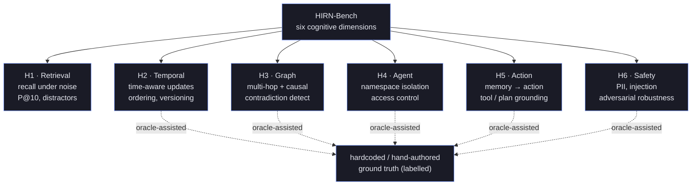
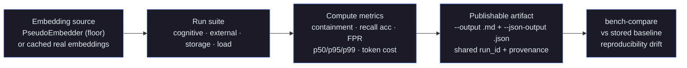

# Benchmark Results
{: .no_toc }

> **⚠️ Experimental:** This project is under active development. APIs, on-disk formats, and behaviour may change without notice. Not recommended for production use.

> HIRN-Bench: cognitive memory evaluation across six dimensions.

## Table of contents
{: .no_toc .text-delta }

1. TOC
{:toc}

---

## Overview

hirn ships with a purpose-built benchmark suite (HIRN-Bench) that evaluates six dimensions of cognitive memory. External benchmark adapters for **LoCoMo**, **DMR**, and **LongMemEval** (ICLR 2025) are included for direct comparison with published competitor results.

Publishable benchmark output belongs under [bench-results/README.md](https://github.com/hupe1980/hirn/blob/main/bench-results/README.md). Treat the target tables below as goals until the corresponding artifact generated by the exact commands in this document is checked in there and reviewable.

Retrieval quality is only meaningful next to its methodology, so read this page as much for its caveats as for its numbers. Three framing facts matter before any table:

- **The headline metric is containment, not answer quality.** HIRN-Bench and the external adapters currently score *substring containment* of the gold answer inside the retrieved context — did the right text make it into the window? That is a retrieval signal, deliberately easier than the LLM-judged answer-generation F1/accuracy that published QA leaderboards report. The two are not interchangeable.
- **Some suites use an oracle.** Several H-suite scenarios inject ground-truth routing or a hand-authored graph so they can isolate one capability. Those measure traversal or retrieval *given* structure, not hirn's ability to construct it. Oracle-assisted scenarios are labelled where they appear.
- **PseudoEmbedder is a floor, not a result.** The default fast path uses hash-based pseudo-embeddings with no semantic signal. It exists to prove the pipeline runs; real-embedding runs score much higher and are the only numbers worth publishing.

> **Warning:** hirn's external-adapter scores (LoCoMo, DMR, LongMemEval) are **substring
> retrieval containment**, *not* the published LLM-judged F1/accuracy those benchmarks
> report — a different and easier metric. They are **not directly comparable** to vendor
> QA leaderboard numbers, and cross-vendor scores are not even comparable to each other
> because every system runs a different generator, judge, and configuration. Use them as
> rough directional context only, never as a release gate and never as evidence of beating
> a published QA score.
{: .warning }

The six suites partition cognitive memory into capabilities that stress different parts of the engine — retrieval, time, graph, isolation, action grounding, and safety:



---

## HIRN-Bench Suites

| Suite | What It Tests | Key Scenarios |
|-------|--------------|---------------|
| **H1 — Retrieval** | Accurate recall under noise and distractors | ~30 episodic memories / ~13 queries at default `--synthetic-scale 1` (scale up for larger corpora), precision@10, noise resistance |
| **H2 — Temporal** | Time-aware memory updates and event ordering | Temporal filtering (AFTER/BEFORE), fact versioning, recency bias |
| **H3 — Graph** | Multi-hop reasoning, causal chains, contradiction detection | Spreading activation, causal traversal, contradiction identification |
| **H4 — Agent** | Multi-agent namespace isolation and access control | Private/shared/team namespaces, cross-agent consolidation |
| **H5 — Action** | Memory → action grounding (tool selection, planning) | Procedural memory recall, tool/action resolution |
| **H6 — Safety** | PII handling, injection resilience, adversarial robustness | Namespace routing, injection rejection, anomaly quarantine |

> ⚠️ **Oracle assistance.** Several suites currently inject ground truth into the harness rather than
> deriving it from hirn: H2 uses hardcoded temporal cutoffs that match the synthetic data, H4 derives
> the query namespace from the relevance labels, H6 routes PII by the query's known category, and
> H3/H5/H6 traverse a **hand-authored** causal/graph structure. These measure traversal/retrieval
> *given* an oracle, not hirn's ability to construct that structure. A no-oracle default and an
> `--oracle` ablation flag are roadmap; do not read these as
> end-to-end system scores.

---

## Advanced Offline Cognition

The Story 3.2 surfaces use a sibling benchmark family rather than the H1-H6 retrieval schema because their success criteria are different: they measure explanation fidelity, offline hypothesis quality, deterministic reconciliation correctness, and agenda usefulness.

| Surface | Command | What It Measures |
|---------|---------|------------------|
| **Explanation quality** | `cargo run -p hirn-bench -- advanced --benchmark explanation` | Retrieval and write-path explanation completeness plus fidelity |
| **Dream hypothesis** | `cargo run -p hirn-bench -- advanced --benchmark dream` | Hypothesis source coverage, provisional review gating, and cost envelope |
| **Reconcile accuracy** | `cargo run -p hirn-bench -- advanced --benchmark reconcile` | Conflict proposal correctness without premature semantic-head mutation |
| **Planning usefulness** | `cargo run -p hirn-bench -- advanced --benchmark plan` | Goal-conditioned agenda quality, support coverage, and explicit gap detection |

The advanced artifact publishes per-surface quality metrics, p50/p95/p99 latency, token envelopes, estimated provider spend, and reproducibility drift summaries when `--runs` is greater than `1`.

---

## Resource-Heavy Workloads

HIRN-Bench is not limited to text-centric recall quality. The live bench surface already includes first-class resource and storage workloads:

| Surface | Command | What It Measures |
|---------|---------|------------------|
| **Storage bench** | `cargo run -p hirn-bench -- storage` | Vector search, hybrid search, multivector search, `Resource Persist`, `Resource Fetch`, and batch graph BFS latencies |
| **Concurrent load** | `cargo run -p hirn-bench -- load` | Mixed remember/recall latency and throughput under concurrent writers/readers |

Use the storage bench when you want a resource-heavy regression profile for first-class resource memory rather than only semantic retrieval quality.

```bash
# Resource-heavy storage profile
cargo run -p hirn-bench -- storage \
	--records 1000 \
	--edges 10000 \
	--limit 10 \
	--measured 5
```

The markdown output includes dedicated `Resource Persist` and `Resource Fetch` rows, which are the primary latency guardrails for the resource-memory surface.

---

## Targets & Baselines

### Target Scores (per Story 4.4)

These thresholds are Hirn's internal H-suite containment targets. They are release-gate goals for this benchmark family, not imported scores from unlike published benchmarks.

| Suite | Target Score | Competitive Threshold | Metric |
|-------|-------------|----------------------|--------|
| H1 — Retrieval | ≥ 0.95 | ≥ 0.80 | containment |
| H2 — Temporal | ≥ 0.90 | ≥ 0.75 | containment |
| H3 — Graph | ≥ 0.95 | ≥ 0.70 | containment |
| H4 — Agent | ≥ 0.85 | ≥ 0.70 | containment |
| H5 — Action | ≥ 0.95 | ≥ 0.75 | containment |
| H6 — Safety | ≥ 0.80 | ≥ 0.75 | containment |

### PseudoEmbedder Floor (validation baseline)

These scores use the built-in `PseudoEmbedder` (hash-based, no real embeddings) and prove the benchmark pipeline works correctly. Real embedding targets are significantly higher.

| Suite | Min Containment | Min Recall Accuracy | Max FPR |
|-------|----------------|--------------------|---------| 
| H1 — Retrieval | 0.20 | 0.50 | 0.10 |
| H2 — Temporal | 0.10 | 0.70 | 0.10 |
| H3 — Graph | 0.75 | 0.75 | 0.10 |
| H4 — Agent | 0.50 | 0.80 | 0.50 |
| H5 — Action | 0.10 | 0.30 | 0.10 |
| H6 — Safety | 0.40 | 0.70 | 1.00 |

### Containment Comparison Floors

| System | Benchmark | Score | Metric | Source |
|--------|-----------|-------|--------|--------|
| Vector DB + RAG | H1 | ~0.75 | containment | Estimated: cosine-recall without reranking |
| Vector DB + RAG | H2 | ~0.50 | containment | Estimated: no temporal filtering |
| Vector DB + RAG | H3 | ~0.40 | containment | Estimated: no graph traversal |

### Directional External References

> ⚠️ **Not comparable to hirn's numbers.** These are published **LLM-generated-answer F1 / accuracy
> with LLM judges**. hirn-bench's external adapters currently score **substring-containment of the
> gold answer in the retrieved context** — a different, easier metric — and every vendor runs a
> different generator/judge/config, so cross-system LoCoMo/LongMemEval scores are *not* comparable
> even between vendors (the public Mem0↔Zep dispute is the canonical example). Use these only as
> rough directional context, never as a hirn release gate. An answer-generation + judged-F1 stage is
> roadmap.

| System | Benchmark | Score | Metric | Source |
|--------|-----------|-------|--------|--------|
| Zep/Graphiti | DMR | 0.948 | DMR accuracy (LLM judge) | [Zep paper, arXiv:2501.13956](https://arxiv.org/abs/2501.13956) |
| MemGPT/Letta | DMR | 0.934 | DMR accuracy | [Zep paper, Table cited](https://arxiv.org/abs/2501.13956) |
| Mem0 | LoCoMo | ~0.92 (vendor) | LLM-judge J-score | [Mem0 benchmark report (2026)](https://mem0.ai/blog/ai-memory-benchmarks-in-2026) |
| Hindsight | LoCoMo / LongMemEval | 0.896 / 0.914 | LLM-judge (open, reproducible) | [arXiv:2512.12818](https://arxiv.org/abs/2512.12818) |

> Earlier revisions of this table listed "TraceMem 0.72 (Maharana et al. Table 3)" and "ActMem 0.68"
> — these were removed: the LoCoMo paper (Maharana et al.) does not evaluate a system named
> "TraceMem", and "ActMem" was an unverifiable placeholder. Do not reintroduce uncitable baselines.

---

## External Benchmark Adapters

hirn-bench includes adapters to run published external benchmarks directly:

### LoCoMo (Long Context + Memory)

- **Paper:** Maharana et al. 2024
- **Measures:** Temporal reasoning, fact recall, multi-hop QA over long conversations
- **hirn metric:** retrieval containment (not the published LLM-judged F1 — not directly comparable)

### DMR (Dynamic Memory Retrieval)

- **Measures:** Retrieval accuracy with dynamic updates
- **hirn metric:** retrieval containment. Note: DMR is effectively saturated (Zep/MemGPT ~93–98%) and both its authors and later work consider it a weak discriminator; prefer LoCoMo/LongMemEval/BEAM.

### LongMemEval (ICLR 2025)

- **Measures:** Long-term memory evaluation across diverse cognitive tasks
- **hirn metric:** retrieval containment. Caveat: hirn-bench currently pools all questions into one
  shared corpus rather than the published per-question haystacks, so results are not directly
  comparable (roadmap fix).

---

## Running Benchmarks

A benchmark run is a short pipeline: pick an embedding source, run one or more suites against synthetic or adapter data, compute the quality/latency/cost metrics, and emit paired publishable artifacts that can later be diffed against a stored baseline. Running one execution with companion output flags keeps the `run_id`, timestamp, and provenance identical across the emitted files.



> **Note:** `PseudoEmbedder` is the intended PR smoke/regression path — it proves the
> pipeline works but carries no semantic signal. Only real-embedding runs from the
> canonical `embeddings/` caches (or a fresh `precompute`) belong in published results.
{: .note }

### Quick Run (PseudoEmbedder)

```bash
# Run all suites with built-in pseudo-embeddings
cargo run -p hirn-bench -- cognitive --benchmark all --no-baselines

# Run a specific suite
cargo run -p hirn-bench -- cognitive --benchmark h1

# Emit paired publishable artifacts from one execution
cargo run -p hirn-bench -- cognitive --benchmark all --format markdown --output bench-results/cognitive.md --json-output bench-results/cognitive.json
```

### Full Run (Real Embeddings)

```bash
# Use the canonical workspace embedding cache for reproducible real-embedding runs
cargo run -p hirn-bench -- cognitive \
	--benchmark all \
	--embeddings embeddings/all_embeddings.json \
	--embedding-model-label text-embedding-3-small \
	--runs 2 \
	--repro-threshold-percent 15 \
	--environment-label macos-local \
	--format markdown \
	--output bench-results/cognitive.md \
	--json-output bench-results/cognitive.json

# Refresh the cache first if you want to regenerate embeddings
OPENAI_API_KEY=sk-... cargo run -p hirn-bench -- precompute --benchmark all --output-dir embeddings
cargo run -p hirn-bench -- cognitive --benchmark all --embeddings embeddings/all_embeddings.json --embedding-model-label text-embedding-3-small --runs 2 --repro-threshold-percent 15
```

`PseudoEmbedder` is the intended PR smoke/regression path. Nightly and manual publishable runs should use the canonical caches in the workspace-root `embeddings/` directory or freshly regenerated caches created via `precompute` / `precompute-external`.

Prefer one benchmark execution with companion output flags (`--json-output`, `--markdown-output`, `--csv-output`) when you want paired artifacts. That keeps `run_id`, generated-at timestamp, provenance fields, and measured metrics identical across the emitted files.

Raw query-text hybrid retrieval is intentionally opt-in via `--query-text-hybrid` on both `cognitive` and `external` runs. Current LoCoMo A/B measurements held quality flat while increasing latency, so publishable benchmark defaults keep that path disabled until it shows a measured net win.

Publishable cognitive reports now include:

- run metadata: generated-at timestamp, dataset source, environment label/image, OS/arch, logical CPUs, token budget, K, embedding source, embedding model label, and pinned workspace provenance (`git_commit_sha`, `cargo_lock_blake3`)
- strategy comparison tables: `hirn` vs `full-context` vs `iterative-retrieval`
- quality metrics: containment, token F1, recall accuracy, MRR, nDCG, FPR
- latency envelopes: per-query p50/p95/p99
- token-cost estimates: context, prompt, and total tokens
- reproducibility summaries when `--runs` is greater than `1`

### External Benchmarks

```bash
# LoCoMo adapter
cargo run -p hirn-bench -- external --format-name locomo --auto-download --embeddings embeddings/locomo_embeddings.json --embedding-model-label text-embedding-3-small --runs 2 --repro-threshold-percent 15

# DMR adapter
cargo run -p hirn-bench -- external --format-name dmr --data-dir /path/to/dmr --embeddings embeddings/dmr_embeddings.json --embedding-model-label text-embedding-3-small --runs 2 --repro-threshold-percent 15

# LongMemEval adapter
cargo run -p hirn-bench -- external --format-name longmemeval --auto-download --embeddings embeddings/longmemeval_embeddings.json --embedding-model-label text-embedding-3-small --runs 2 --repro-threshold-percent 15
```

LoCoMo auto-download now uses the canonical upstream GitHub repository `snap-research/locomo` and caches the published `data/locomo10.json` file directly. The loader accepts that raw `locomo10.json` schema without repacking, so `--data-dir` can point either at the cache directory or at an upstream checkout/mirror.

DMR auto-download is intentionally disabled until a verified public canonical dataset source is configured. Use `--data-dir` with a local mirror that contains `dialogs.json`.

LongMemEval auto-download uses direct HuggingFace file downloads because the dataset does not expose a working rows API. Set `HF_TOKEN` (or the legacy `HUGGING_FACE_HUB_TOKEN`) or authenticate once with `huggingface-cli login` if your environment needs authenticated access. Expect a multi-GB transfer for the published `longmemeval_oracle`, `longmemeval_s`, and `longmemeval_m` files; for repeatable CI or local review, prefer a warm cache or a local mirror passed through `--data-dir`.

The default reproducibility envelope is `15%` max relative drift across quality, query-latency, and token-cost metrics. Tighten it for controlled lab environments if you need stricter publication gates.

### Concurrent Load Envelope

```bash
# Deterministic mixed remember/recall load benchmark
cargo run -p hirn-bench -- load \
	--writers 4 \
	--readers 8 \
	--writes-per-writer 50 \
	--writer-batch-size 16 \
	--max-auto-edges-per-record 0 \
	--reads-per-reader 100 \
	--preseed-records 128 \
	--dims 64 \
	--k 10 \
	--format markdown \
	--output bench-results/load.md \
	--json-output bench-results/load.json
```

By default the load harness keeps `max_auto_edges_per_record = 0` so the reported envelope isolates storage plus recall concurrency instead of graph-maintenance work.

Use a non-zero auto-edge budget when you want the benchmark to exercise the product write path that now uses batched multi-query candidate search:

```bash
cargo run -p hirn-bench -- load \
	--writers 4 \
	--readers 8 \
	--writes-per-writer 50 \
	--writer-batch-size 16 \
	--max-auto-edges-per-record 10 \
	--reads-per-reader 100 \
	--preseed-records 128 \
	--dims 64 \
	--k 10 \
	--format markdown
```

The load benchmark reports:

- remember p50/p95/p99 latency under concurrent writers
- recall p50/p95/p99 latency under concurrent readers
- aggregate remember/recall/total ops-per-second for the timed load window
- writer and reader failure counts
- preseed time, timed load-window duration, total runtime, peak RSS, and DB file size

Nightly automation publishes this result alongside the cognitive and external benchmark artifacts as `bench-results/load.md` and `bench-results/load.json`.

### Advanced Offline Cognition Workflow

Use the advanced suite when you need an end-to-end regression path for offline cognition and explanation surfaces rather than only retrieval quality.

```bash
# 1. Run the full advanced suite, emit paired artifacts, and update regression history
cargo run -p hirn-bench -- advanced --benchmark all --format markdown --output bench-results/advanced.md --json-output bench-results/advanced.json --tracker bench-results/advanced-history.json

# 2. Compare the candidate artifact to a baseline
cargo run -p hirn-bench -- bench-compare --baseline bench-results/advanced-baseline.json --current bench-results/advanced.json --threshold 5.0
```

What the advanced artifact is actually measuring:

- **Explanation quality** checks that retrieval and write-path explanations expose the fields operators rely on: score breakdowns, suppression reasons, policy scope, and fast/slow-path routing.
- **Dream hypothesis** checks provisional hypothesis quality, source-memory linkage, and whether outputs remain quarantined until review.
- **Reconcile accuracy** checks that conflict-repair proposals are deterministic and do not mutate active semantic heads before approval.
- **Planning usefulness** checks ordered subgoals, evidence coverage, unresolved gaps, and budget-preserving partial outputs.

How to read the result:

- `primary_score` is the regression headline for a surface.
- `precision`, `recall`, `accuracy`, and `usefulness` are surface-specific quality signals, not interchangeable retrieval metrics.
- p50/p95/p99 latency and token/spend envelopes matter because these operators are intentionally budgeted offline jobs, not request-path helpers.
- reproducibility drift tells you whether the operator stayed materially similar across repeated runs under the same configuration.

Enable the advanced operators in production when you have explicit offline windows, quarantine review, and a reason to expose explanation or planning artifacts to operators or downstream agents.

Do not enable them on user-facing latency-critical paths, in environments without rollback or review hooks, or when provider spend is not budgeted and monitored.

Production readiness checklist:

- explicit offline windows or batch maintenance periods
- scheduler budgets for wall-clock, token, spend, and result volume
- quarantine review or approval automation for generated cognition
- rollback monitoring for approved reconcile and planning outputs
- a stored baseline artifact plus `bench-compare` in CI or nightly automation

See [offline-intelligence.md](offline-intelligence.md) for the operator workflow and [explanation-surfaces.md](explanation-surfaces.md) for the explanation contract those benchmarks inspect.

### Storage / Resource Envelope

```bash
# First-class resource/storage latency profile
cargo run -p hirn-bench -- storage \
	--records 1000 \
	--dims 64 \
	--edges 10000 \
	--bfs-depth 2 \
	--bfs-frontier 100 \
	--measured 5
```

This profile reports p50/p95/p99/mean for:

- vector search
- hybrid search (RRF)
- multivector search
- resource persist
- resource fetch
- batch BFS

---

## Metrics

HIRN-Bench uses three primary metrics:

| Metric | Description |
|--------|-------------|
| **Containment** | Fraction of expected answer content present in recall results |
| **Recall Accuracy** | Whether the correct records are in the top-k results |
| **False Positive Rate (FPR)** | Rate of incorrect/irrelevant results in top-k |

For concurrent load runs, hirn-bench additionally publishes p50/p95/p99 latency and ops/sec envelopes for mixed remember/recall traffic. These runs measure throughput and tail latency, not semantic quality.

The final score per suite is a **geometric mean** of its component metrics, providing a single comparable number across systems.

---

## Interpretation

- **Scores ≥ target:** hirn meets or exceeds the SOTA target for that dimension.
- **Scores ≥ competitive threshold:** hirn is competitive with published systems.
- **Scores below competitive:** indicates an area for optimization (typically requires real embedding models rather than PseudoEmbedder).

H3 (Graph) and H4 (Agent) scores are typically strong even with PseudoEmbedder because graph edges and namespace isolation provide structural signals independent of embedding quality. H1 (Retrieval) and H5 (Action) scores improve significantly with real embedding models.
---

## Synthetic Benchmark Baseline (Lance 4.0 / First-Class Resources)

Baseline captured on the current Lance 4.0 `hirn-storage` surface with first-class resources enabled.

**Configuration:** 500 records, 64 embedding dimensions, 10 queries, k=10, token budget=4096, PseudoEmbedder, 1 warmup + 3 measured runs.

### Retrieval Quality

| Metric | Value |
|--------|-------|
| P@10 | 0.0800 |
| R@10 | 0.0133 |
| F1 | 0.0229 |
| MRR | 0.0792 |
| NDCG@10 | 0.0646 |

> Low quality scores expected \u2014 PseudoEmbedder uses hash-based pseudo-embeddings with no semantic signal.

### Latency

| Operation | Mean |
|-----------|------|
| remember (batch 500) | 4.6 s |
| recall | 213 ms |
| think | 3.6 s |

### Throughput

| Operation | Ops/sec |
|-----------|---------|
| remember | 65.1 |
| recall | 1.6 |
| think | 0.1 |

### Resource Usage

| Metric | Value |
|--------|-------|
| Peak RSS | 390.94 MB |
| Total time | 125.89 s |

---

## See Also

- [Concepts](concepts.md) — the retrieval, graph, and consolidation machinery these suites exercise
- [Cognitive Model](cognitive-model.md) — why the six dimensions map to distinct memory capabilities
- [HirnQL Reference](hirnql-reference.md) — the query surface the benchmarks drive
- [Security Architecture](security.md) — the injection and isolation defenses H4/H6 probe
- [Deployment & Operations](operations.md) — running and monitoring hirn beyond the bench harness
- [Offline Intelligence](offline-intelligence.md) — the operator workflow behind the advanced suite
- [Explanation Surfaces](explanation-surfaces.md) — the explanation contract the advanced benchmarks inspect