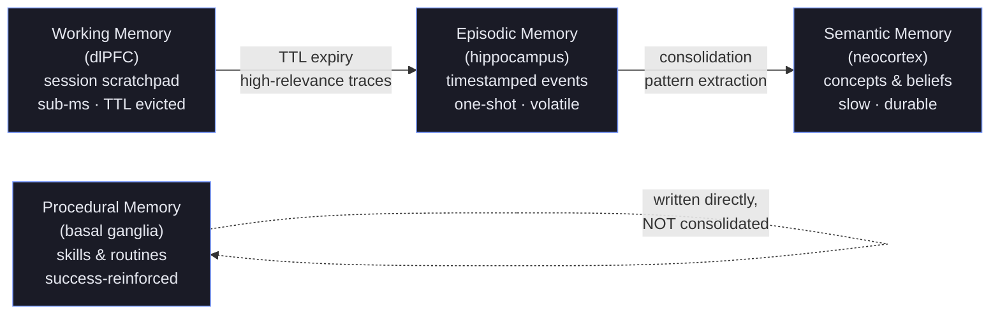
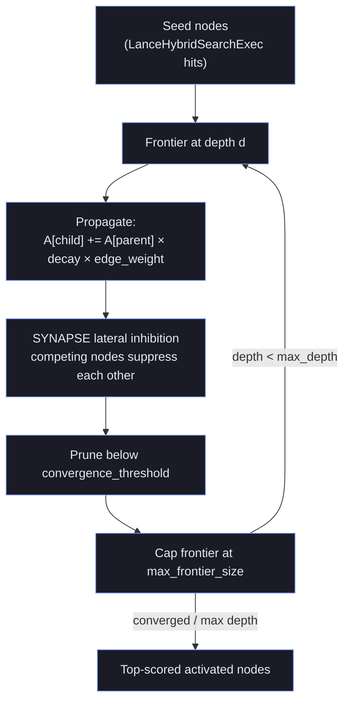
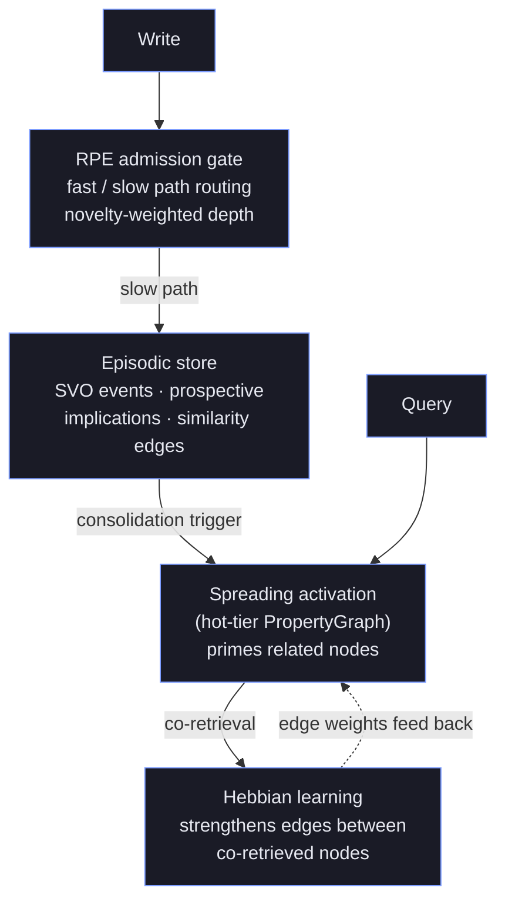

# Cognitive Model
{: .no_toc }

This project is under active development. APIs, on-disk formats, and behaviour may change without notice. Not recommended for production use.
{: .experimental }

## Table of contents
{: .no_toc .text-delta }

1. TOC
{:toc}

---

## Why a cognitive model?

Most agent "memory" systems are a single vector index with a similarity search bolted on top.
That works for one-shot retrieval, but it collapses the distinctions the brain spends enormous
metabolic effort to maintain: the difference between what you are thinking about *right now*
(working memory), what happened *to you* (episodic memory), what you *know* in the abstract
(semantic memory), and what you know *how to do* (procedural memory). Those distinctions are not
cosmetic — they have different capacities, different write costs, different decay rates, and
different retrieval dynamics.

Hirn implements a **biologically-grounded four-tier memory model** that maps directly to human
neuroanatomy. The design draws on two well-established research lineages. The first is the
**Complementary Learning Systems (CLS)** theory of McClelland, McNaughton & O'Reilly (1995), which
argues the brain needs *both* a fast hippocampal store for one-shot episodic encoding *and* a slow
neocortical store that extracts statistical regularities over time — precisely the episodic →
semantic split hirn implements as a consolidation pipeline. The second is **Squire's taxonomy of
long-term memory** (1987) together with **Baddeley's working-memory model** (1974), which give the
four-way partition its cognitive-science backbone. At the agent-architecture level the model is
aligned with **CoALA** (Cognitive Architectures for Language Agents, Sumers et al.), which
recommends exactly this separation of memory types for LLM agents.

This document explains how the tiers map to neuroscience, what fires the tier transitions, how RPE,
spreading activation, and Hebbian learning interplay, and how the model relates to published research.

The distinctions below are *load-bearing*: choosing the right tier for a write is the single most
important decision an agent makes about its own memory. Working memory that should have been
episodic is lost on TTL expiry; episodic noise that should never have been written pollutes recall.
{: .tip }

See also: [Architecture](architecture.md), [Causal Reasoning](causal.md), [Write-Path Intelligence](write-path.md), [HirnQL Reference](hirnql-reference.md), [Performance Tuning](performance-tuning.md)

---

## The Four-Tier Model

The four tiers form a pipeline from volatile-and-fast to durable-and-slow. Each tier maps to a
distinct brain region, holds a distinct content type, and has its own admission and eviction rules:



Read the arrows as *promotion under a condition*, not automatic flow: only high-relevance working
entries survive to episodic, and only episodic patterns that clear the consolidation trigger become
semantic. Procedural memory is deliberately outside this cascade — skills are earned by explicit
writes and reinforced by success rate, never distilled from raw events.
{: .note }

The original ASCII sketch of the same model:

```
┌───────────────────────────────────────────────────────────────────────────┐
│                         COGNITIVE MODEL                                   │
│                                                                           │
│  Working ──► Episodic ──► Semantic ──► Procedural                        │
│  (PFC)       (hippocampus)  (cortex)    (basal ganglia)                  │
│                                                                           │
│  Speed: sub-ms    30ms       30ms         30ms                           │
│  Scope: session   events     concepts     skills                          │
└───────────────────────────────────────────────────────────────────────────┘
```

### Working Memory (Prefrontal Cortex equivalent)

**Neurological basis:** The dorsolateral prefrontal cortex (dlPFC) maintains information in an
active, immediately accessible state. Capacity is sharply limited (Miller's Law: 7±2 chunks) and
content is subject to rapid displacement and interference.

**Hirn implementation:**
- Stored in Lance `working` dataset with TTL-based eviction (configurable `tier_working_to_episodic_ttl_secs`)
- Hot path: BTree-indexed `logical_memory_id` for sub-millisecond lookup
- On TTL expiry: high-relevance entries are automatically promoted to episodic as traces (low-relevance are discarded)
- Content model: `WorkingMemoryEntry` with `logical_memory_id`, `content`, `relevance_score`, `token_count`, and an absolute `expires_at` timestamp (there is no `importance`/`ttl_ms` field — TTL is expressed as the `expires_at` instant)
- Revision semantics: successive `set_working()` calls for the same `logical_memory_id` create a temporal revision chain

**When to use:** Conversational context, current task state, agent scratch-pad. Anything the agent
needs to access in the current interaction without the overhead of a full recall pipeline.

---

### Episodic Memory (Hippocampus equivalent)

**Neurological basis:** The hippocampus encodes specific events with rich contextual binding:
who, what, when, where. Episodic memory is the fastest mammalian memory for new learning (one-shot
encoding). It is also the most volatile — subject to forgetting, interference, and reconsolidation
during retrieval.

**Hirn implementation:**
- Stored in Lance `episodic` dataset (time-series ordered by `timestamp_ms`)
- `SVO events` extracted at write time via `SvoExtractionExec` (Chronos subsystem) — indexes who/what/when
- `ProspectiveImplications` generated at write time via `ProspectiveIndexingExec` (Kumiho subsystem) — enables future-query short-circuiting
- **RPE-gated admission** (see below) — controls write enrichment depth
- `TemporalNext` edges in the graph link episodes in namespace-local arrival order for temporal contiguity retrieval
- Reconsolidation window: after retrieval, a labile window (default: 1 hour) re-opens the memory to correction

**When to use:** Agent-generated events, observations, conversation turns, tool outputs. Any
time-stamped fact the agent should recall later.

---

### Semantic Memory (Neocortex equivalent)

**Neurological basis:** The neocortex (particularly temporal and association cortex) consolidates
episodic patterns into abstract, decontextualized knowledge. Semantic memory survives hippocampal
damage — it is robust, slow to form (requires repetition), but very long-lasting. Humans form
semantic knowledge through sleep-based consolidation that replays episodic traces and extracts
regularities.

**Hirn implementation:**
- Stored in Lance `semantic` dataset
- Formed by the **Consolidation Pipeline** (see below) — not written directly by agents except via `REMEMBER semantic`
- Represents concepts, beliefs, facts, summarized narratives
- Supports explicit versioned revision via `CORRECT`, `SUPERSEDE`, `MERGE MEMORY`, `RETRACT`
- Community-detection-based narrative clustering groups related episodes into coherent semantic threads
- RAPTOR hierarchical summarization builds multi-level concept trees from episodic clusters

**When to use:** Agent beliefs about the world, user preferences, extracted entities, summarized
conversation history. Content that should survive session boundaries and be accessible across agents.

---

### Procedural Memory (Basal Ganglia equivalent)

**Neurological basis:** The basal ganglia encode **skills** — sequences of actions that, with
practice, become automatic. Procedural memory is implicit: it guides behavior without conscious
recall. Success rate is the key currency: skills that work get reinforced, skills that fail get
discarded.

**Hirn implementation:**
- Stored in Lance `procedural` dataset
- `success_rate: f32` (clamped `[0.0, 1.0]`) — core signal for tier transitions
- Tier transition: `tier_procedural_min_success_rate` — skills below this threshold are demoted
- Graph edges link procedural records to the episodic evidence that shaped them (`DerivedFrom` edges)
- Skills are never consolidated from episodic; they must be written explicitly via `REMEMBER procedural` or agent tools

**When to use:** Reusable multi-step procedures, system prompt fragments, tool-use patterns,
workflow templates.

---

## Tier Transitions

```
                    TTL expiry
Working ──────────────────────────────► Episodic
  │         (high-relevance traces)
  └─ (low-relevance) ──► discarded

                    Consolidation threshold
Episodic ─────────────────────────────► Semantic
          (pattern extraction,
           RAPTOR summarization,
           community detection)

                    Archive threshold
Semantic ──────────────────────────────► (archived)
          (`tier_semantic_archive_threshold`)

Procedural: written directly, NOT consolidated from episodic.
```

### Working → Episodic

**Trigger:** Working memory TTL expiry (`tier_working_to_episodic_ttl_secs`, default configurable)

**Condition:** Entry importance ≥ episodic admission threshold. Low-importance expired entries
are discarded.

**Process:**
1. Background task scans for expired `working` entries
2. High-importance entries are re-encoded as `EpisodicRecord` via the full write path
3. Entry is deleted from the `working` dataset

**HirnQL:** Tier promotion is automatic; no explicit query.

### Episodic → Semantic

**Trigger:** One of three paths:
1. **Interference-driven:** Cumulative interference score in the write path exceeds
   `interference_consolidation_threshold` (default 0.3). 5-minute cooldown prevents cascades.
2. **Periodic:** Background task fires every `consolidation_interval_secs` (default 3600).
3. **Explicit:** `CONSOLIDATE WHERE ...` HirnQL statement.

**Process (Consolidation Pipeline):**
1. **Segmentation:** Groups recent episodes by temporal proximity and topic
2. **Community detection:** weighted Louvain-style modularity optimization with a connectivity post-pass (weighted-Louvain fidelity, not a full Leiden refinement) and adaptive resolution (`√(2·total_edge_weight/n)`)
3. **Narrative clustering:** RAPTOR hierarchical summarization per community
4. **Causal discovery:** temporal co-occurrence heuristic (labelled `temporal_granger`). Note: a true lagged-predictability Granger test, LLM validation, and Bayesian accumulation are **roadmap**, not yet wired into the pipeline.
5. **Semantic upsert + memory evolution:** Results written to the `semantic` dataset; existing records are corroborated (A-MEM evolution); superseded episodes are archived.

> **NLI contradiction detection (DeBERTa-MNLI) and ABA/AGM conflict resolution** exist as HirnQL
> query operators (`NliContradictionExec`, `AbaReconsolidationExec`), but are **not** stages of the
> automatic consolidation pipeline. Treat them as an "implemented preview" query surface.

### Semantic → Archived

**Trigger:** Semantic record importance/retention falls below `tier_semantic_archive_threshold`
(configurable; default `0.1`). Retention is the Ebbinghaus `R = exp(−h/S)` curve, so a record that
has not been retrieved for a long time decays toward the threshold on its own. (There is no separate
`tier_semantic_archive_after_days` knob — recency enters through `R`.)

---

## RPE: Reward Prediction Error — The Admission Gate

**Neuroscience basis:** The dopaminergic system signals **surprise** (RPE = actual outcome −
predicted outcome). Novel stimuli (high RPE) trigger deeper encoding; familiar stimuli (low RPE)
pass through lightweight encoding. This is the biological basis for why you remember surprising
events better than routine ones (von Restorff effect).

**Hirn implementation:**

RPE is computed per write via `compute_rpe()`:

```
1. Embed incoming content → query vector
2. Search episodic + semantic + procedural datasets for nearest neighbors
3. max_similarity = max cosine similarity across all search results
4. distance = 1.0 − max_similarity
5. z_score = (distance − μ) / σ   [Welford online, per partition key]
6. RPE = distance × (1 + z_score)   [clamped to 0..=2]
```

**Partition key:** realm × namespace × embedding model — z-score baselines are not mixed across
namespaces or model versions.

**Fast path (RPE < `rpe_fast_path_threshold`, default 0.3):**
- Importance heuristic: `0.3 + 0.2 × rpe_score`
- Skip prospective indexing
- Skip SVO extraction
- Low enrichment cost

**Slow path (RPE ≥ threshold):**
- Full pipeline: prospective indexing (Kumiho templates), SVO extraction (Chronos), interference tracking
- Full enrichment cost

**Configuration:**

| Parameter | Default | Description |
|-----------|---------|-------------|
| `rpe_enabled` | `false` | Enable RPE routing (false = always slow path) |
| `rpe_fast_path_threshold` | `0.3` | RPE below this → fast path |
| `rpe_similarity_search_limit` | `5` | Neighbors to consider per dataset |

**Design rationale — why gate on surprise?** Encoding every write with the full pipeline (prospective
indexing, SVO extraction, interference tracking) is expensive, and most agent writes are routine
restatements of things already known. The dopaminergic system solves the same problem in the brain:
novel stimuli that violate prediction (high RPE) trigger deep encoding, while familiar stimuli pass
through cheaply. This is why surprising events are remembered better than routine ones — the von
Restorff isolation effect (1933). RPE routing gives hirn the same "spend attention where it is
warranted" economics. The z-score term makes novelty *relative* to a per-partition baseline, so a
namespace full of similar content still surfaces its own outliers.
{: .note }

`rpe_enabled` defaults to `false`, meaning every write takes the slow path unless you opt in.
Enable it when write throughput matters and your workload is dominated by low-novelty content.
{: .important }

---

## Spreading Activation

**Neuroscience basis:** The associative cortex spreads activation from an input concept to
semantically related concepts via Hebbian-strengthened synaptic pathways. This is how priming
works: hearing "nurse" activates "hospital", "doctor", "medicine" without explicit retrieval.

**Hirn implementation:**

Spreading activation operates on the **hot-tier PropertyGraph** (in-memory petgraph, sub-ms).

```
1. Seed nodes: memory IDs returned by LanceHybridSearchExec
2. Per depth level:
   a. For each frontier node, follow outgoing edges (weighted)
   b. Propagate activation: A[child] += A[parent] × decay_factor × edge_weight
   c. Apply SYNAPSE lateral inhibition:
         inhibition = inhibition_strength × (1 − Jaccard_similarity(neighbors_j, neighbors_k))
      (competing nodes suppress each other; related nodes are spared)
   d. Prune nodes below convergence_threshold
   e. Cap frontier at max_frontier_size
3. Return top-scored activated nodes
```

As a control-flow diagram, one propagation level looks like this:



**Design rationale — why inhibition?** Pure additive spreading activation has a failure mode:
a densely connected hub node accumulates activation from every path and drowns out specific,
relevant memories. Lateral inhibition, modelled on cortical inhibitory interneurons (Douglas &
Martin, 2004), makes topically *dissimilar* competitors suppress each other while sparing genuinely
related nodes — the Jaccard term measures shared neighbourhoods, so only true competitors are
penalised. This is the SYNAPSE mechanism.
{: .note }

**Activation modes (settable via `EXPAND GRAPH DEPTH n ACTIVATION mode`):**

| Mode | Description |
|------|-------------|
| `spreading` | Full spreading activation (default) |
| `ppr` | Personalized PageRank — globally re-ranks all nodes relative to seed |
| `pagerank` | Global PageRank — ignores seeds |
| `static` | No decay — uniform propagation |
| `none` | Disable graph expansion entirely |

**Deep traversal (depth > `graph_depth_delegation_threshold`, default 5):**
Hot-tier DFS is used for shallow depths. Deeper traversals delegate to `PersistentGraph::deep_causal_bfs()`
which performs batched BFS against the Lance `graph_nodes` + `graph_edges` cold-tier datasets.

**Configuration:**

| Parameter | Default | Description |
|-----------|---------|-------------|
| `activation_decay_factor` | `0.7` | Per-hop decay multiplier |
| `activation_max_depth` | `3` | Maximum propagation depth |
| `activation_convergence_threshold` | `0.01` | Prune nodes below this activation score |
| `activation_max_iterations` | `10` | Maximum propagation iterations |
| `inhibition_strength` | `0.1` | SYNAPSE lateral inhibition strength |
| `activation_max_frontier_size` | `10000` | Safety cap on fan-out per depth level |

---

## Hebbian Learning

**Neuroscience basis:** "Cells that fire together wire together" (Hebb, 1949). Synaptic connections
between neurons that co-activate are strengthened. This is the biological basis for associative
memory — retrieving item A makes item B more accessible because they were previously retrieved
together.

**Hirn implementation:**

Hebbian learning operates via `HebbianBufferExec`:

1. Every `RECALL` or `THINK` records all co-retrieved memory pairs to the `HebbianBuffer` (lock-free `crossbeam::SegQueue`)
2. On buffer flush (threshold-triggered or explicit `close()`):
   - Co-retrieved pairs with an **existing** associative edge (`SimilarTo` / `RelatedTo`): **edge weight increased** (bounded, clamped to `1.0`)
   - Hebbian learning **only strengthens/decays existing edges; it does not create new edges.** (There is no `CoActivated` relation; a dedicated associative relation created on co-retrieval is a roadmap item.)
3. Weights decay over time via FadeMem (see below)

**FadeMem adaptive decay (replaces static temporal decay):**

```
rate = base_rate × (1 / (1 + importance)) × (1 / (1 + access_frequency))
```

High-importance, frequently-accessed memories decay slower. Working memory uses TTL eviction, not FadeMem.

**Configuration:**

| Parameter | Default | Description |
|-----------|---------|-------------|
| `hebbian_learning_rate` | `0.1` | Weight increase per co-retrieval (α) |
| `hebbian_decay_rate` | `0.05` | Per-cycle weight decay for unused edges |

The recall-buffer flush threshold is a fixed constant (every **16** recall operations,
`DEFAULT_FLUSH_THRESHOLD` in `hirn-graph`), not a configurable knob.

---

## The Recall Pipeline

A `RECALL` or `THINK` query compiles to a DataFusion `LogicalPlan` and executes through these
composed physical operators:

```
[QueryComplexity]     → classify Simple/Medium/Complex
       │
LanceHybridSearch     → dense (ANN) + sparse (FTS) search over Lance datasets
       │
[GraphActivation]     → spread activation from seed nodes (hot-tier PropertyGraph)
       │
[CausalChain]         → traverse causal edges (Pearl rung 1)
       │
[IterativeRetrieval]  → multi-hop: retrieve → reformulate → retrieve (THINK only)
       │
[QualityGate]         → 4-dim score: coverage × confidence × coherence × sufficiency
       │                 escalate depth if below threshold
HebbianBuffer         → record co-retrieved pairs for future weight updates
       │
[ContextBudget]       → token-budget enforcement (greedy score/token ratio)
```

Brackets indicate conditionally-emitted operators (based on HirnQL clauses and query depth).

### Depth Scheduling

`DEPTH AUTO` (default) classifies query complexity and selects pipeline depth:

| Complexity | Criteria | Pipeline |
|------------|----------|---------|
| `Simple` | Low token count, no temporal keywords, few entities | LanceHybridSearch → HebbianBuffer → ContextBudget |
| `Medium` | Moderate complexity, some graph-adjacent content | + GraphActivation |
| `Complex` | High token count, temporal reasoning, many entities, iterative needed | Full pipeline with QualityGate + IterativeRetrieval |

`DEPTH FULL` forces the full pipeline. `DEPTH SUMMARY` skips graph activation.

**Auto-escalation:** If quality score < threshold after retrieval and depth < Complex, the query is
re-run at the next depth level (maximum 1 escalation per query). Metric: `hirn_quality_gate_escalations_total`.

---

## Causal Reasoning: Pearl's Three-Rung Hierarchy

Hirn implements the full three-rung causal hierarchy (Pearl, 2018):

| Rung | Question | HirnQL | Operator |
|------|----------|--------|---------|
| 1 — Association | "What causes X?" | `EXPLAIN CAUSES "X"` | `CausalChainExec` + `CausalQueryReadExec` |
| 2 — Intervention | "What if we do Y?" | `WHAT_IF "Y" THEN "Z"` | `CausalQueryReadExec` (intervention mode) |
| 3 — Counterfactual | "Would X have happened if not Y?" | `COUNTERFACTUAL "X" THEN "Y"` | `CausalQueryReadExec` (counterfactual mode) |

**Causal edges** on the graph carry: `strength`, `confidence`, `evidence_count`, `confounders`,
`provenance`, `mechanism`. Relevance score: `strength × confidence × ln(1 + evidence_count)`.

**Causal discovery** during consolidation currently uses a temporal co-occurrence heuristic
(edges labelled `temporal_granger`); a true Granger lagged-predictability test, LLM validation, and
Bayesian evidence accumulation are roadmap. The `NliContradictionExec` operator detects
contradictions via DeBERTa-MNLI (5–15ms/pair) and `AbaReconsolidationExec` resolves them via formal
argumentation (ABA) + AGM belief revision — both are **query operators** ("implemented preview"),
not automatic consolidation stages.

---

## Neuroscience Literature Mapping

| Hirn Concept | Neuroscience Basis | Reference |
|-------------|-------------------|-----------|
| Four-tier memory model | Baddeley's working memory model + Squire's taxonomy | Baddeley (1974); Squire (1987) |
| RPE admission gate | Dopaminergic RPE signal (Schultz et al.) | Schultz, Dayan & Montague (1997) |
| Spreading activation | Associative cortex spreading activation | Collins & Loftus (1975) |
| Hebbian learning | Synaptic potentiation | Hebb (1949) |
| Consolidation pipeline | Hippocampal → cortical memory consolidation | McClelland, McNaughton & O'Reilly (1995) |
| Reconsolidation window | Memory lability after retrieval | Nader, Schafe & LeDoux (2000) |
| SYNAPSE lateral inhibition | Cortical inhibitory interneurons | Douglas & Martin (2004) |
| FadeMem adaptive decay | Ebbinghaus forgetting curve + Bahrick retention | Ebbinghaus (1885); Bahrick (1984) |
| Causal reasoning | Pearl's do-calculus | Pearl (2009) |
| RAPTOR consolidation | Hierarchical memory organization | Shu et al. "RAPTOR" (2024) |
| RPE z-score novelty | von Restorff isolation effect | von Restorff (1933) |
| Dream cycle hypothesis generation | REM sleep memory consolidation | Stickgold (2005) |

---

## Summary: How the Three Mechanisms Interplay

```
                    ┌─────────────────────────┐
  Write             │   RPE ADMISSION GATE     │
  ──────────────────►  (fast/slow path routing) │
                    │   novelty-weighted depth  │
                    └──────────┬──────────────┘
                               │ slow path
                               ▼
                    ┌─────────────────────────┐
                    │  EPISODIC STORE          │
                    │  SVO events, prospective │
                    │  implications, graph     │
                    │  similarity edges        │
                    └──────────┬──────────────┘
                               │ consolidation trigger
                               ▼
  Consolidation     ┌─────────────────────────┐
  ──────────────────►  SPREADING ACTIVATION    │◄──── Query
                    │  (hot-tier PropertyGraph) │
                    │  primes related nodes     │
                    └──────────┬──────────────┘
                               │ co-retrieval
                               ▼
                    ┌─────────────────────────┐
                    │  HEBBIAN LEARNING        │
                    │  strengthens edges       │
                    │  between co-retrieved    │
                    │  nodes                   │
                    └─────────────────────────┘
```

The same loop as a graph — note that spreading activation sits at the intersection of the write
side (which built the graph) and the read side (which queries it), and Hebbian learning feeds the
edge weights back:



1. **RPE** controls _which_ memories get rich structure at write time.
2. **Spreading activation** controls _which_ memories surface at query time.
3. **Hebbian learning** ensures that memories retrieved together become easier to retrieve together in the future.

Together these three mechanisms implement **use-dependent memory**: memories that are written
with surprise, retrieved frequently, and retrieved together become the most accessible — exactly
the pattern observed in human long-term memory.
