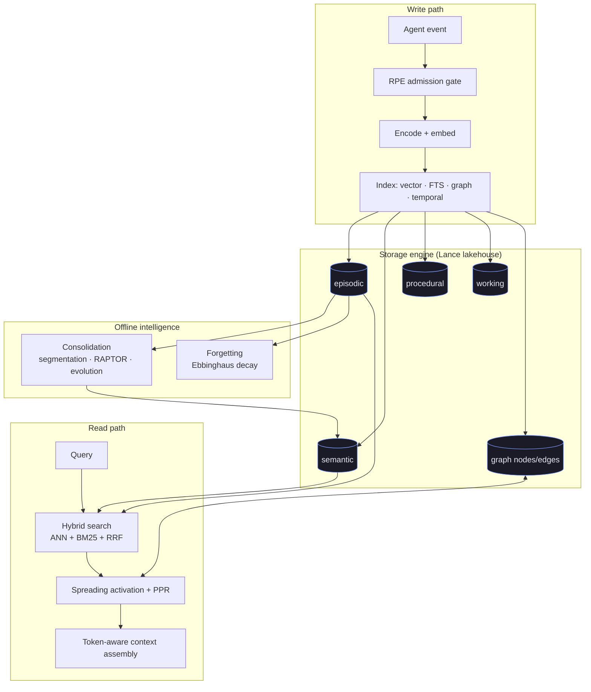

# Concepts
{: .no_toc }

hirn is built on a small set of ideas borrowed from cognitive neuroscience and
modern retrieval research, implemented as **database primitives** rather than
application glue. This section explains the theory and how it maps to the engine.

## How the pieces fit

## In this section

- **[Cognitive Model](cognitive-model.md)** — the four memory layers (episodic,
  semantic, procedural, working), tier transitions, RPE admission, spreading
  activation, and Hebbian learning, mapped to neuroscience.
- **[Architecture](architecture.md)** — crate layout, the storage engine, the
  query pipeline, and how the graph, temporal, and vector indices compose.
- **[Causal Reasoning](causal.md)** — Pearl's three rungs (association,
  intervention, counterfactual) over the property graph.
- **[Write-Path Intelligence](write-path.md)** — what happens at write time: SVO
  extraction, prospective indexing, interference tracking, and enrichment depth.

## Related

- Query the model with the **[HirnQL Reference](hirnql-reference.md)**.
- Understand durability in **[Advanced → Write Guarantees](write-guarantees.md)**.
