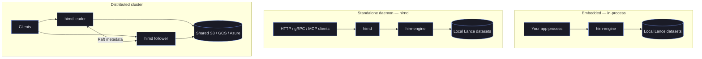
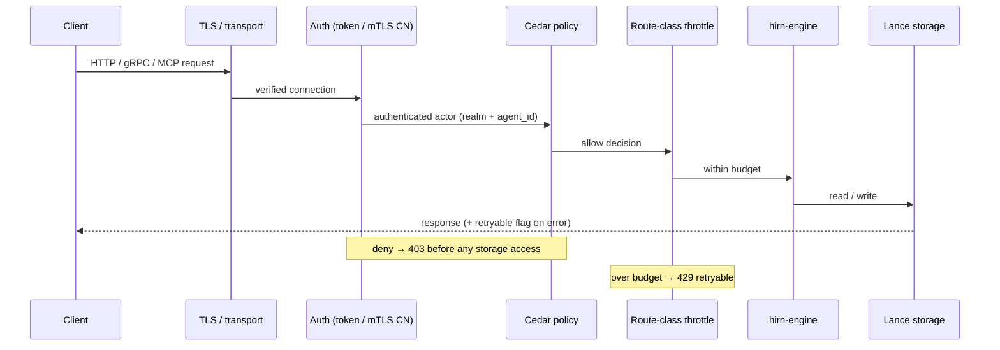
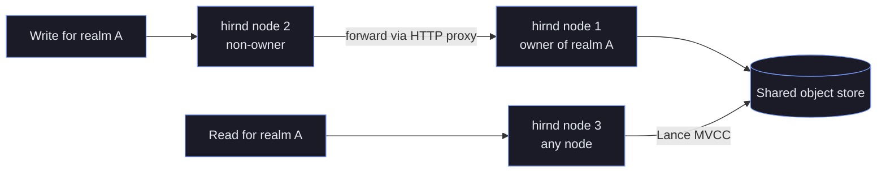

# Deployment Modes
{: .no_toc }

> **⚠️ Experimental:** This project is under active development. APIs, on-disk formats, and behaviour may change without notice. Not recommended for production use.

hirn supports multiple deployment modes, from embedded library to distributed cluster. Choose the mode that fits your architecture.

## Table of contents
{: .no_toc .text-delta }

1. TOC
{:toc}

---

## Choosing a Deployment Mode

hirn is built as a single cognitive engine (`hirn-engine`) that can be consumed
in three fundamentally different operational shapes. The engine, the storage
format, and the cognition pipeline are identical in all of them — what changes
is *who owns the process* and *how clients reach it*.

- **Embedded** — the engine runs inside your own process as a Rust library (with
  Python and Node.js bindings). There is no network, no daemon, and no separate
  lifecycle to manage. This is the SQLite-style model: lowest latency, simplest
  operations, single-writer.
- **Standalone daemon (`hirnd`)** — the engine runs behind a server process that
  exposes gRPC, HTTP/REST, and MCP. Many clients, languages, and LLM tool callers
  share one memory store over the network, with TLS, authentication, and Cedar
  policy enforcement on every request.
- **Distributed cluster** — several `hirnd` nodes coordinate metadata through
  Raft (or DynamoDB in serverless mode) over shared object storage, giving
  horizontal scale across realms and automatic failover.

Start embedded. Move to a daemon when more than one process needs the same
memory, or when an LLM needs an MCP tool endpoint. Move to a cluster only when a
single node can no longer meet availability or throughput requirements — the
coordination machinery is real operational surface area you do not want until you
need it.



{: .tip }
> There is no lock-in between modes. All modes read and write the same Lance
> on-disk format, so you can prototype embedded and later point a `hirnd` daemon
> at the same brain directory.

---

## Embedded (Library Mode)

The simplest mode — hirn runs in-process as a Rust library. No daemon, no network. Like SQLite.

**Use when:** Single-process application, low latency requirement, simplest possible setup.

```rust
use hirn::prelude::*;

#[tokio::main]
async fn main() -> HirnResult<()> {
    let db = HirnMemory::open("./brain").await?;
    let id = db.remember("The sky is blue").await?;
    let ctx = db.think("What color is the sky?").await?;
    println!("{}", ctx.context);
    Ok(())
}
```

**Python:**

```python
from hirn import Memory

mem = Memory.open("./brain")
mem.remember("The sky is blue")
ctx = mem.think("What color is the sky?")
print(ctx.context)
```

**Node.js:**

```js
import { Memory } from '@hupe1980/hirn';

const mem = Memory.open('./brain');
await mem.remember('The sky is blue');
const ctx = await mem.think('What color is the sky?');
console.log(ctx.context);
```

**Characteristics:**
- Zero network overhead
- Data stored in local Lance datasets
- Single-writer (one process at a time)
- Best performance for single-agent workloads

---

## Standalone Daemon (hirnd)

`hirnd` runs as a standalone server exposing gRPC, HTTP/REST, and MCP interfaces. Multiple clients connect over the network.

**Use when:** Multiple clients or languages need access, microservice architecture, MCP tool server.

### Starting the Daemon

`hirnd` now fails closed by default: configure `[auth]` credentials for normal startup, or pass the explicit `--insecure-dev-mode` switch for local unauthenticated development.

The `hirnd` CLI accepts only these flags (see `hirnd --help`): `--config <file>`
(TOML), `--data <dir>`, `--bind <addr>`, and `--insecure-dev-mode`. TLS,
ports, and auth are configured in the TOML file, not via flags.

```bash
# Basic start — bind address sets the base port; HTTP = base, gRPC = base+1, MCP (SSE) = base+2
hirnd --config hirnd.toml --data ./brain --bind 127.0.0.1:3000

# Local insecure development only (no auth, loopback bind)
hirnd --insecure-dev-mode --data ./brain --bind 127.0.0.1:3000
```

TLS is enabled by adding a `[tls]` section to `hirnd.toml` (`cert_path`,
`key_path`, optional `client_ca_path` for mTLS) — see the Security section below.

> **mTLS identity mapping requires a client CA.** If you configure
> `[auth.client_certs]` (mapping certificate CNs to identities), you MUST also
> set `tls.client_ca_path`. Startup fails otherwise. Without mandatory,
> server-verified mTLS the `x-client-cert-cn` identity would come from a
> client-supplied header that any caller can forge — so the daemon refuses that
> configuration rather than trust an unauthenticated CN.

### Interfaces

The `--bind` address is the base port; the other interfaces are derived from it.

| Interface | Default port | Protocol | Use Case |
|-----------|------|----------|----------|
| HTTP | `3000` (base) | REST + JSON | Web clients, curl, simple integrations |
| gRPC | `3001` (base+1) | HTTP/2 + Protobuf | High-throughput programmatic access |
| MCP (SSE) | `3002` (base+2) | Model Context Protocol over SSE | LLM tool calling (Claude, GPT, etc.) |

Binding all three interfaces to a single base port keeps firewall rules and
service discovery simple: expose `--bind` and the daemon derives the rest. The
HTTP loopback default (`127.0.0.1:3000`) is deliberately conservative — nothing
is reachable off-host until you bind a routable address and configure `[tls]`.

### Request Lifecycle

Every daemon request runs through the same ordered pipeline: transport, then
authentication (bearer token or verified mTLS identity), then Cedar policy
evaluation, then route-class throttling keyed by the authenticated actor, and
only then the engine and storage. Authorization happens before any storage
access, so a denied request never touches Lance.



See [Security](security.md) for the full authentication and policy model.

### HTTP Client Example

```bash
# Obtain a token (when [auth] is configured), then call the REST API
curl -sX POST http://127.0.0.1:3000/v1/remember \
  -H "Authorization: Bearer $TOKEN" \
  -H "Content-Type: application/json" \
  -d '{"agent_id":"agent-1","content":"The sky is blue"}'
```

> There is no `hirn::client::HirnClient` type. Rust programs embed the engine
> directly (`Hirn::open`) or call the daemon's HTTP/gRPC endpoints with a
> standard client.

### MCP Integration

hirnd exposes hirn as an MCP tool server. Configure your LLM client to connect:

```json
{
  "mcpServers": {
    "hirn": {
      "command": "hirnd",
      "args": ["--data", "./brain", "--bind", "127.0.0.1:3000"]
    }
  }
}
```

Available MCP tools: `remember`, `recall`, `think`, `forget`, `connect`, `inspect`, `trace`, `consolidate`.

{: .warning }
> **Browser-based DNS-rebinding exposure.** The current MCP transport does not
> validate the `Host` header, so while the MCP listener is running, a malicious
> website opened in a local browser can potentially reach it via DNS rebinding —
> even on loopback. Keep MCP disabled unless you use it, and front it with a
> reverse proxy that validates `Host`/`Origin` for anything beyond throwaway
> local development. A transport upgrade that validates `Host` natively is
> planned.

{: .important }
> **MCP authentication.** The MCP listener authenticates **once at startup**:
> outside `insecure_dev_mode` you must set `mcp.auth_token` in the config to an
> API key or JWT accepted by your `[auth]`/`[token]` settings. Every MCP tool
> call then runs as that validated identity — realm, agent, operation scope,
> and namespace scope come from the credential, never from tool parameters —
> and is rate-limited with the same route classes as the HTTP API. HirnQL run
> through `hirn_execute` is verb-classified, so a read-scoped credential cannot
> execute write or admin statements.

### Sleep-Time Consolidation

While the daemon is idle, `hirnd` opportunistically runs cognitive maintenance
so it never competes with live traffic — the same idea as "sleep-time compute"
in agent-memory research: reorganize memory off the hot path instead of at
query time.

Every authenticated request (HTTP, gRPC, or MCP) resets an idle clock; health
probes and unauthenticated traffic do not. Once the daemon has been quiet for
`idle_after_secs`, a background scheduler runs one **sleep pass** per open
realm:

1. **Consolidation pipeline** — segmentation → pattern extraction → community
   detection → RAPTOR summaries → forgetting, via the same engine pipeline as
   `POST /v1/consolidate`.
2. **Offline cognition jobs** — one `dream` and one `reconcile` job are
   enqueued *only if* the engine's offline scheduler is enabled, using its
   configured default budget (see [Offline Intelligence](offline-intelligence.md)).
   The scheduler is off by default; turn it on per daemon via
   `[engine] offline_scheduler_enabled = true`.

The pass re-checks the idle clock between phases and aborts as soon as a
foreground request arrives. Passes are spaced at least
`min_pass_interval_secs` apart.

```toml
[sleep]
enabled = true                 # set to false to disable sleep passes
idle_after_secs = 300          # quiet time before the daemon counts as idle
check_interval_secs = 60       # how often the scheduler evaluates idleness
min_pass_interval_secs = 3600  # minimum spacing between two passes
```

Validation requires `idle_after_secs >= check_interval_secs` and all values
greater than zero when enabled. To disable the feature entirely, set
`sleep.enabled = false`.

Observability: each pass logs a `sleep_pass` tracing span with per-phase
durations, increments the `hirnd_sleep_passes_total` counter (label
`result = completed|aborted`), sets the
`hirnd_sleep_last_pass_timestamp_seconds` gauge, and exposes the last pass
timestamp as `sleep_last_pass_ms` in `GET /debug/brain-stats`.

**Characteristics:**
- Multi-client access over network
- gRPC for performance, HTTP for convenience, MCP for LLMs
- Single-node storage (local Lance datasets)
- TLS + mTLS support
- Route-class throttling keyed by authenticated actor (`realm + agent_id`)
- Cedar policy enforcement per request
- Idle-time sleep passes (consolidation + offline cognition) when traffic stops

---

## Distributed Cluster (Multi-Node)

`hirnd` supports multi-node deployment with OpenRaft-based metadata consensus. All nodes share a remote object store (S3, GCS, Azure) while Raft handles cluster coordination, realm ownership, and consolidation leases.

**Use when:** High availability, horizontal scaling across realms, cloud-native deployment.

### Architecture

```
┌─────────────┐    ┌─────────────┐    ┌─────────────┐
│  hirnd (1)  │◄──►│  hirnd (2)  │◄──►│  hirnd (3)  │
│  Leader     │    │  Follower   │    │  Follower   │
└──────┬──────┘    └──────┬──────┘    └──────┬──────┘
       │                  │                  │
       └──────────────────┼──────────────────┘
                          │
                   ┌──────┴──────┐
                   │  S3 / GCS  │
                   │  (shared)  │
                   └─────────────┘
```

**Raft consensus** manages cluster metadata only — realm-to-node ownership, node registry, and consolidation leases. Data is stored in Lance on shared object storage (S3/GCS/Azure) using MVCC for consistency.

### Cluster Configuration (TOML)

**Node 1 (initial leader):**

```toml
bind = "0.0.0.0:3000"
data_dir = "/data/hirn"

[storage]
uri = "s3://my-bucket/hirn-data"
properties = { "storage.region" = "us-east-1" }
fragment_cache_dir = "/data/cache"
fragment_cache_max_bytes = 2147483648  # 2 GiB

[raft]
node_id = 1
transport_profile = "prod-tls"
advertise_addr = "https://10.0.0.1:3000"
transport_secret = "$HIRND_RAFT_TRANSPORT_SECRET"
peers = [
  { id = 2, addr = "https://10.0.0.2:3000" },
  { id = 3, addr = "https://10.0.0.3:3000" },
]
heartbeat_interval_ms = 150
election_timeout_min_ms = 300
election_timeout_max_ms = 500
```

**Node 2:**

```toml
bind = "0.0.0.0:3000"
data_dir = "/data/hirn"

[storage]
uri = "s3://my-bucket/hirn-data"
properties = { "storage.region" = "us-east-1" }
fragment_cache_dir = "/data/cache"

[raft]
node_id = 2
transport_profile = "prod-tls"
advertise_addr = "https://10.0.0.2:3000"
transport_secret = "$HIRND_RAFT_TRANSPORT_SECRET"
peers = [
  { id = 1, addr = "https://10.0.0.1:3000" },
  { id = 3, addr = "https://10.0.0.3:3000" },
]
```

All nodes in the cluster must share the same `raft.transport_secret`. hirnd fails startup when `[raft]` is configured without that secret unless `insecure_dev_mode = true` is set for explicit local-only development. Cluster addresses must include an explicit URL scheme; production profiles require `https://`, while `dev-local` permits only loopback `http://` endpoints.

### Cluster Bootstrap

**Step 1:** Start all nodes. Node 1 initializes the cluster:

```bash
# On node 1 — bootstrap the cluster
curl -X POST http://10.0.0.1:3000/v1/cluster/init \
  -H "Authorization: Bearer YOUR_API_KEY" \
  -H "Content-Type: application/json" \
  -d '{"nodes": [{"id": 1, "addr": "https://10.0.0.1:3000"}, {"id": 2, "addr": "https://10.0.0.2:3000"}, {"id": 3, "addr": "https://10.0.0.3:3000"}]}'
```

**Step 2:** Nodes 2 and 3 join (or are added by the leader):

```bash
# Add node 2
curl -X POST http://10.0.0.1:3000/v1/cluster/join \
  -H "Authorization: Bearer YOUR_API_KEY" \
  -H "Content-Type: application/json" \
  -d '{"node_id": 2, "addr": "10.0.0.2:3000"}'

# Add node 3
curl -X POST http://10.0.0.1:3000/v1/cluster/join \
  -H "Authorization: Bearer YOUR_API_KEY" \
  -H "Content-Type: application/json" \
  -d '{"node_id": 3, "addr": "10.0.0.3:3000"}'
```

Cluster management routes (`/v1/cluster`, `/v1/cluster/init`, `/v1/cluster/join`, `/v1/cluster/metrics`) are authenticated control-plane endpoints and no longer run on the public unauthenticated router.

**Step 3:** Verify cluster health:

```bash
curl http://10.0.0.1:3000/v1/cluster/metrics
# Returns: { "id": 1, "state": "Leader", "current_leader": 1, ... }
```

### Single-Node Auto-Init

When no `peers` are configured, hirnd auto-initializes a single-node Raft cluster at startup — no manual bootstrap needed:

```toml
insecure_dev_mode = true

[raft]
node_id = 1
transport_profile = "dev-local"
advertise_addr = "http://127.0.0.1:3000"
# peers = []  ← empty or omitted → auto-init
```

### Shard-Per-Realm Affinity

Each realm is assigned to a preferred node for write operations. Writes to non-owner nodes are forwarded transparently:

- **Reads:** Served by any node (Lance MVCC on shared storage)
- **Writes:** Forwarded to the realm's owner node via HTTP proxy
- **Failover:** If the owner is down, any node can serve reads from shared storage



{: .warning }
> Every node in a cluster must share the same `raft.transport_secret`, and
> production `transport_profile` values (`prod-tls` / `prod-mtls`) require
> `https://` cluster URLs. `hirnd` fails startup if `[raft]` is configured without
> the secret unless `insecure_dev_mode = true`. Keep Raft traffic on a private
> network — the `/raft/*` endpoints are control-plane transport, not public API.

### Consolidation Leases

Only one node runs consolidation/compaction per realm at a time. Leases are coordinated through Raft:

- Lease duration: 5 minutes (auto-renewed by the holder)
- If the holder crashes, the lease expires and another node can acquire it
- Different nodes can compact different realms concurrently

### Internal Raft Trust Assumptions

Raft HTTP routes are internal cluster transport endpoints. Treat them as control-plane traffic, not public API surface.

- Keep Raft traffic on a private network or require mTLS between nodes.
- Configure `raft.transport_profile = "prod-tls"` or `"prod-mtls"` outside local development. Production profiles require HTTPS cluster URLs, and `prod-mtls` also requires `tls.client_ca_path` so inbound Raft endpoints require client certificates.
- Configure the same `raft.transport_secret` on every node; `/raft/*` requests are rejected unless that shared secret matches, except in explicit `insecure_dev_mode` with `dev-local` transport.
- Leader-driven `append` and `snapshot` traffic is rejected unless the sender is a current voting member.
- Leader-driven `append` and `snapshot` traffic is also rejected when the request term is stale, or when the sender conflicts with the receiver's current leader for the same term.
- `vote` requests are rejected when the candidate is not a current voting member or the request term is stale.
- These checks prevent forged or replayed Raft transport traffic from reaching the log/state-machine path, but they are not a substitute for transport authentication.

**Characteristics:**
- Horizontal scaling across realms (shard-per-realm)
- High availability via Raft leader election
- Shared storage eliminates data replication overhead
- Fragment cache accelerates reads from remote storage
- Sub-second leader election (300–500ms timeout)

---

## Serverless Mode (AWS Lambda / Fargate)

For serverless deployments without persistent nodes, hirn uses S3 for data and DynamoDB for cluster coordination (instead of Raft).

**Use when:** AWS Lambda, Fargate, or other ephemeral compute. No persistent nodes available for Raft.

### Build with Serverless Feature

```bash
cargo build -p hirnd --features serverless
```

### Configuration

```toml
bind = "0.0.0.0:3000"

[storage]
uri = "s3://my-bucket/hirn-data"
properties = { "storage.region" = "us-east-1" }
fragment_cache_dir = "/tmp/hirn-cache"
fragment_cache_max_bytes = 536870912  # 512 MiB

# No [raft] section — serverless mode uses DynamoDB instead
```

**Environment variables for DynamoDB:**

| Variable | Description | Default |
|----------|-------------|---------|
| `HIRN_DYNAMO_METADATA_TABLE` | DynamoDB table for metadata | `hirn_metadata` |
| `HIRN_DYNAMO_LOCKS_TABLE` | DynamoDB table for leases | `hirn_locks` |
| `AWS_REGION` | AWS region | Required |
| `AWS_ENDPOINT_URL` | Custom endpoint (LocalStack) | — |

### DynamoDB Tables

hirn automatically creates tables on first access (`ensure_tables()`):

- **`hirn_metadata`** — Partition key: `pk` (String), Sort key: `sk` (String). Stores realm assignments, node registry, heartbeats.
- **`hirn_locks`** — Partition key: `lock_id` (String). TTL-based lease expiry for consolidation coordination. Conditional writes ensure only one writer acquires a lock.

**Characteristics:**
- Zero persistent infrastructure (fully serverless)
- DynamoDB conditional writes for optimistic concurrency
- TTL-based lock expiry (no cleanup needed)
- Works with AWS Lambda, Fargate, ECS, or any ephemeral compute
- S3 storage with local fragment caching for hot data

---

## Distributed Cluster

Multi-node hirnd deployment with Raft consensus for metadata coordination and shared object-store storage. Provides horizontal scaling, automatic failover, and shard-per-realm write affinity.

**Use when:** High availability, multi-tenant isolation with independent scaling, large-scale deployments.

### Architecture

- **Raft consensus** — metadata only (realm ownership, node registry, consolidation leases). Data stays in Lance on shared object store
- **Shard-per-realm** — each realm has one write-owner node; reads from any node via shared storage
- **Shared storage** — S3, GCS, or Azure Blob as the Lance data plane; all nodes see the same datasets

### 3-Node Cluster Example

**Node 1** (`hirnd-1.toml`):

```toml
bind = "0.0.0.0:3000"
data_dir = "/data/hirn"

[storage]
uri = "s3://my-bucket/hirn-data"
properties = { "storage.region" = "us-east-1" }
fragment_cache_dir = "/cache/hirn"
fragment_cache_max_bytes = 2147483648  # 2 GiB

[raft]
node_id = 1
transport_profile = "prod-tls"
advertise_addr = "https://10.0.0.1:3000"
transport_secret = "$HIRND_RAFT_TRANSPORT_SECRET"
peers = [
  { id = 2, addr = "https://10.0.0.2:3000" },
  { id = 3, addr = "https://10.0.0.3:3000" },
]
heartbeat_interval_ms = 150
election_timeout_min_ms = 300
election_timeout_max_ms = 500
```

**Node 2** and **Node 3** use the same config with their own `node_id` and `advertise_addr`, and list the other two nodes as peers.

### Bootstrapping the Cluster

```bash
# Start all three nodes
hirnd --config hirnd-1.toml &
hirnd --config hirnd-2.toml &
hirnd --config hirnd-3.toml &

# Initialize the cluster from any node (leader election starts)
curl -X POST http://10.0.0.1:3000/v1/cluster/init

# (Optional) Add a 4th node later
curl -X POST http://10.0.0.1:3000/v1/cluster/join \
  -H 'Content-Type: application/json' \
  -d '{"id": 4, "addr": "https://10.0.0.4:3000"}'
```

### Cluster Status

```bash
curl http://10.0.0.1:3000/v1/cluster/metrics | jq
```

Returns Raft metrics: `mode`, `node_id`, `state` (Leader/Follower/Candidate), `current_leader`, `term`, `last_applied`, `members`.

### Single-Node Quick Start

When no `peers` are configured, `hirnd` auto-initializes a single-node Raft cluster at startup — no `/v1/cluster/init` call needed:

```toml
insecure_dev_mode = true

[raft]
node_id = 1
transport_profile = "dev-local"
advertise_addr = "http://127.0.0.1:3000"
# peers = []  (empty or omitted → auto-init)
```

### S3 / Remote Storage Backend

The `[storage]` section configures the shared object store used by all nodes:

| Field | Description | Default |
|-------|-------------|---------|
| `uri` | Object store root: `s3://bucket/path`, `gs://bucket/path`, `az://container/path` | — (required) |
| `properties` | Vendor-specific properties (region, endpoint, credentials) | `{}` |
| `fragment_cache_dir` | Local NVMe/SSD path for caching fragments | — (disabled) |
| `fragment_cache_max_bytes` | Maximum cache size in bytes | 1 GiB |

**MinIO / Local S3:**

```toml
[storage]
uri = "s3://hirn-data"
properties = { "storage.region" = "us-east-1", "storage.endpoint" = "http://minio:9000", "storage.allow_http" = "true" }
```

### Serverless Mode (AWS Lambda / Fargate)

Build with `--features serverless` to use DynamoDB for metadata coordination instead of Raft. No persistent nodes needed.

```toml
[dynamo]
metadata_table = "hirn-metadata"
locks_table = "hirn-locks"
region = "us-east-1"
# endpoint_url = "http://localhost:8000"  # For local DynamoDB

[storage]
uri = "s3://my-bucket/hirn-data"
properties = { "storage.region" = "us-east-1" }
```

**DynamoDB tables are created automatically** on first startup (`ensure_tables()`). Lease acquisition uses conditional writes with TTL-based expiry for distributed locking.

**Characteristics:**
- Zero persistent infrastructure (Lambda + DynamoDB + S3)
- Automatic lease management and realm assignment
- Pay-per-request pricing model
- Cold-start latency (~200ms for DynamoDB table check)

---

## Multi-Agent Configuration

Both embedded and daemon modes support multi-agent isolation. Each agent gets namespace-scoped memory with Cedar policy enforcement.

```sql
-- Register agents
REMEMBER episode BY "agent-research" CONTENT "Quantum computing uses qubits"
REMEMBER episode BY "agent-writing" CONTENT "The report deadline is Friday"

-- Each agent sees only its own memories
RECALL episodic BY "agent-research" ABOUT "computing" LIMIT 10
```

Cedar policies control cross-agent visibility:

```cedar
permit(
  principal == Agent::"agent-research",
  action == Action::"recall",
  resource
) when { resource.namespace == "research" };
```

---

## Configuration Reference

### Environment Variables

| Variable | Description | Default |
|----------|-------------|---------|
| `HIRN_DB_PATH` | Database directory path | `./brain` |
| `OPENAI_API_KEY` | OpenAI API key for embeddings | — |
| `OLLAMA_HOST` | Ollama server URL | — |
| `HIRN_LOG` | Log level (trace, debug, info, warn, error) | `info` |

### HirnConfig Options

Key configuration parameters (set programmatically via `HirnConfig::builder()`):

| Parameter | Default | Description |
|-----------|---------|-------------|
| `embedding_dimensions` | 768 | Vector dimensionality |
| `token_budget` | 4096 | Default context assembly budget |
| `rpe_fast_path_threshold` | 0.3 | RPE score below which LLM is skipped |
| `quality_gate_threshold` | 0.5 | Minimum quality score before auto-escalation |
| `consolidation_interval_secs` | 0 | Auto-consolidation interval (0 = disabled) |
| `max_node_count` | 500000 | Maximum graph nodes before eviction |
| `graph_depth_delegation_threshold` | 5 | Hot→cold tier depth threshold |

See `HirnConfig` API docs for the full list of 40+ configuration parameters.

---

## Storage Layout

A hirn brain directory contains:

```
brain/
├── episodic/           # Lance dataset — timestamped events
├── semantic/           # Lance dataset — consolidated facts
├── procedural/         # Lance dataset — skills/procedures
├── working/            # Lance dataset — short-term memory
├── graph_nodes/        # Lance dataset — persistent graph nodes
├── graph_edges/        # Lance dataset — persistent graph edges
├── svo_events/         # Lance dataset — Subject-Verb-Object events
├── prospective_implications/  # Lance dataset — prospective queries
├── topic_loom/         # Lance dataset — per-topic timelines
├── mcfa_audit_log/     # Lance dataset — security audit trail
└── _brain_manifest     # Lance table — database metadata
```

All datasets use Lance 4.0 columnar format with IVF-PQ vector indices.
