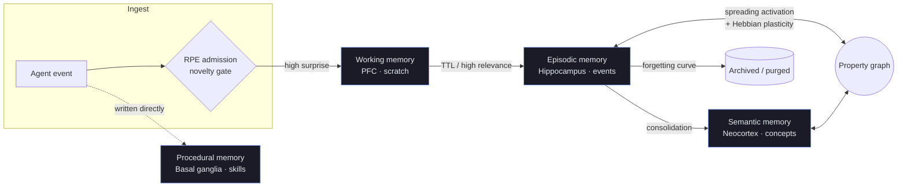

<div class="hirn-hero" markdown="0">
  <span class="hirn-eyebrow">Cognitive memory engine · Rust · Apache-2.0</span>
  <h1>The brain an LLM never had</h1>
  <p class="hirn-sub">
    hirn gives LLM-based agents persistent, structured memory with
    biologically-inspired consolidation, graph-based reasoning, and multi-agent
    isolation — all in a single embeddable Rust library, with zero external
    services required.
  </p>
  <div class="hirn-cta">
    <a class="hirn-btn primary" href="{{ '/getting-started/' | relative_url }}">Get started →</a>
    <a class="hirn-btn ghost" href="{{ '/concepts/' | relative_url }}">Explore the model</a>
    <a class="hirn-btn ghost" href="https://github.com/hupe1980/hirn">GitHub</a>
  </div>
</div>

> **⚠️ Experimental:** This project is under active development. APIs, on-disk formats, and behaviour may change without notice. Not recommended for production use.

## Why hirn?

LLMs are evolving from stateless chatbots into long-running autonomous agents.
This creates infrastructure gaps that vector stores and KV caches cannot fill:

- **Long-term memory** beyond the context window.
- **Structured reasoning** over that memory — causal chains, temporal queries, associative recall.
- **Multi-agent isolation** with provenance tracking and per-agent authorization.

hirn exists because the gap between *"LLM with a vector store"* and *"LLM with a
brain"* is a **database problem**. Its core innovation is **graph-native
cognitive memory**, where spreading activation, temporal indexing, Hebbian
plasticity, and consolidation are database primitives — not application-layer bolts.

<div class="hirn-grid" markdown="0">
  <div class="hirn-card">
    <div class="hirn-card-ico">🧠</div>
    <h3>Four-layer memory</h3>
    <p>Episodic, semantic, procedural, and working memory — mirroring human cognitive architecture (CLS + CoALA).</p>
  </div>
  <div class="hirn-card">
    <div class="hirn-card-ico">🕸️</div>
    <h3>Graph-native recall</h3>
    <p>Spreading activation, Personalized PageRank (HippoRAG-style), and Hebbian edge plasticity as engine primitives.</p>
  </div>
  <div class="hirn-card">
    <div class="hirn-card-ico">🔎</div>
    <h3>Deep retrieval stack</h3>
    <p>IVF-HNSW + BM25 + hybrid RRF + ColBERT MaxSim multivector search over a Lance lakehouse.</p>
  </div>
  <div class="hirn-card">
    <div class="hirn-card-ico">⏳</div>
    <h3>Temporal & bi-temporal</h3>
    <p>ULID ordering, temporal contiguity retrieval, and valid-time fact versioning (valid_from/valid_until).</p>
  </div>
  <div class="hirn-card">
    <div class="hirn-card-ico">🌙</div>
    <h3>Consolidation</h3>
    <p>Surprise-based segmentation, RAPTOR summaries, memory evolution, and spaced-repetition forgetting.</p>
  </div>
  <div class="hirn-card">
    <div class="hirn-card-ico">🔐</div>
    <h3>Cedar authorization</h3>
    <p>Fine-grained RBAC/ABAC per operation, namespace isolation, and a tamper-evident audit trail.</p>
  </div>
</div>

## The cognitive model at a glance

hirn organizes memory into four layers that map to human neuroanatomy, with
information flowing between them through biologically-grounded tier transitions.



Read the full model in **[Concepts → Cognitive Model](cognitive-model.md)**.

## Quick start

Add hirn to a Rust project and give an agent a brain in a few lines:

```rust
use hirn::{Hirn, HirnConfig, HirnResult};
use hirn_core::types::AgentId;

#[tokio::main]
async fn main() -> HirnResult<()> {
    // Zero-config embedded mode — a local, single-file cognitive store.
    let brain = Hirn::open("./brain").await?;
    brain.register_agent(&AgentId::new("agent-1")?, "My Agent").await?;
    let ctx = brain.as_agent(&AgentId::new("agent-1")?).await?;

    // Remember an event…
    ctx.remember_text("The deployment on Friday failed due to a config drift").await?;

    // …then recall associatively later.
    let hits = ctx.recall_text("why did the deploy fail?").limit(5).execute().await?;
    for hit in hits { println!("{}", hit.content()); }
    Ok(())
}
```

<div class="hirn-cta" markdown="0" style="margin-top:1rem">
  <a class="hirn-btn primary" href="{{ '/getting-started/' | relative_url }}">Full getting-started guide →</a>
  <a class="hirn-btn ghost" href="{{ '/hirnql-reference/' | relative_url }}">HirnQL query language</a>
</div>

## Deployment modes

| Mode | Description | Use case |
|------|-------------|----------|
| **Embedded** | `Hirn::open("./brain")` — single-process, zero-config | Local agents, prototyping |
| **Standalone** | `hirnd` daemon with HTTP/gRPC/MCP, fail-closed auth by default | Multi-client, microservices |

See **[Deployment & Operations](operations.md)**.

## Where to go next

- **New to hirn?** Start with **[Getting Started](getting-started.md)**.
- **Want the theory?** Read **[Concepts](concepts.md)** — cognitive model, architecture, causal reasoning.
- **Querying memory?** See the **[HirnQL Reference](hirnql-reference.md)**.
- **Running in production?** See **[Deployment & Operations](operations.md)** and **[Security](security.md)**.
- **Benchmarking?** See **[Benchmarks](benchmarks.md)**.

---

<small>hirn is licensed under Apache-2.0. Built with Rust, [Lance](https://lancedb.github.io/lance/), [DataFusion](https://datafusion.apache.org/), [Cedar](https://www.cedarpolicy.com/), and [petgraph](https://docs.rs/petgraph/).</small>
