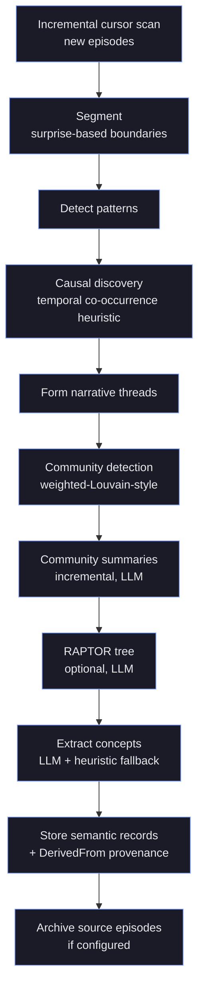
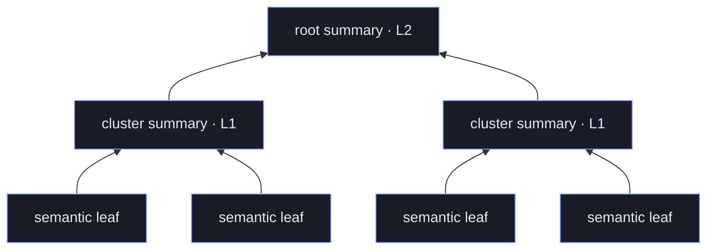

# Offline Intelligence
{: .no_toc }

This project is under active development. APIs, on-disk formats, and behaviour may change without notice. Not recommended for production use.
{: .experimental }

hirn treats expensive synthesis as a first-class offline workflow, not a hidden side effect of `remember`, `recall`, or `think`.

## Table of contents
{: .no_toc .text-delta }

1. TOC
{:toc}

That design is deliberate:

- online paths stay latency-bounded and predictable
- expensive generation is budgeted explicitly
- generated outputs remain reviewable and reversible
- every state transition is persisted for audit, replay, and recovery

## Mental Model

An offline job is a typed request with four parts:

- **kind**: the operator to run (`Dream`, `Reconcile`, `Plan`, plus follow-on operators such as `Reflect`, `Summarize`, and `Evaluate`)
- **target**: an explicit scope (`topic`, `goal`, `event_segment`, `temporal_window`, `memory_ids`, `logical_memory_ids`, or `namespace`/`realm`)
- **budget**: wall-clock, token, spend, and result-volume limits
- **review path**: quarantine, approval, and rollback metadata for generated outputs

The scheduler never accepts an empty target. `OfflineJobTarget` must name the slice of memory you want the operator to work over.

## Why It Exists

Online memory engines usually fail in one of two ways:

- they hide expensive synthesis inside the request path and become unpredictable under load
- they generate useful-looking knowledge without any durable review or rollback surface

hirn avoids both problems by pushing slow cognition into a separate runtime with explicit operator budgets and append-only history in the `offline_jobs` dataset.

## Job Kinds

### Dream

`Dream` searches for distant-but-co-relevant semantic heads and generates provisional hypotheses.

- outputs are quarantined semantic records, not active truths
- review metadata records quality score, threshold, and approval status
- hypothesis events (`HypothesisGenerated`, `HypothesisValidated`, `HypothesisDiscarded`) flow through the normal observability pipeline

Use it when you want hypothesis generation, semantic bridging, or weak-signal discovery during maintenance windows.

### Reconcile

`Reconcile` produces deterministic conflict-repair proposals.

- proposals snapshot the conflict-resolution policy used to make the recommendation
- approval can supersede or retain existing semantic heads depending on the proposal action
- rollback is explicit and only succeeds while the affected logical memories have not moved on

Use it when semantic heads disagree and you want an auditable repair workflow instead of silent mutation.

### Plan

`Plan` emits a `PlanningAgenda` with ordered subgoals, rationale, supporting memory references, evidence resources, and unresolved gaps.

- result volume is clamped to the configured budget
- plans stay reviewable and provisional until promoted
- the generated agenda is revision-aware, which matters when the supporting semantic surface keeps changing

Use it when you need bounded strategic synthesis rather than nearest-neighbor retrieval.

## Targets And Budgets

`OfflineJobTarget` supports multiple selectors, and they can be combined when you need a narrower slice:

- `namespace` or `realm` for tenancy boundaries
- `topic` for topical maintenance passes
- `goal` for planning-oriented synthesis
- `event_segment` or `temporal_window` for time-bounded replay
- `memory_ids` or `logical_memory_ids` for exact scoped analysis

`OperatorBudget` is enforced by the scheduler runtime:

- `wall_clock_limit_ms`
- `token_limit`
- `provider_spend_limit_usd`
- `max_result_volume`

When an operator would exceed budget, hirn either aborts or downgrades according to the configured budget-exceeded policy.

## Lifecycle

The full lifecycle is explicit and durable:

1. `schedule_offline_job()` validates the target and budget.
2. The scheduler queues the job by priority and available concurrency.
3. Each transition is appended to `offline_jobs`.
4. The operator runs against the scoped semantic or procedural slice.
5. Outputs are written as quarantined generated cognition with `GeneratedCognitionReview` metadata.
6. Operators inspect status with `offline_job_status()` or full history with `inspect_offline_job()`.
7. Failed or capped work can be retried with `retry_offline_job()` or replayed with `replay_offline_job()`.
8. Approved generated outputs can be reversed with `rollback_quarantine_approval()` when policy permits.

## Rust Example

```rust
use hirn::prelude::*;
use hirn_core::{CognitiveJob, CognitiveJobKind, OfflineJobTarget, OperatorBudget};

let mut target = OfflineJobTarget::topic("checkout incidents");
target.namespace = Some(Namespace::default_ns());

let mut job = CognitiveJob::new(CognitiveJobKind::Dream, target);
job.budget = OperatorBudget {
    wall_clock_limit_ms: 30_000,
    token_limit: 4_000,
    provider_spend_limit_usd: 0.25,
    max_result_volume: 16,
};
job.rationale = Some("nightly hypothesis pass for recurring checkout failures".into());

let job_id = memory.db().admin().schedule_offline_job(job).await?;
let inspection = memory
    .db()
    .admin()
    .inspect_offline_job(job_id)
    .await?
    .expect("scheduled job should exist");

println!("latest status: {:?}", inspection.latest.status);
```

## Review And Rollback

Generated cognition is not trusted by default.

- low-quality outputs remain quarantined
- approvals are explicit and auditable
- reconcile and planning promotions record enough lineage to support rollback
- rollback is guarded so you cannot silently revert over newer accepted revisions

This is the security and operator difference between offline intelligence and a simple background cron job.

## Background Consolidation

The budgeted operator jobs above are the *on-demand* half of offline
intelligence. The other half runs continuously: a **consolidation pipeline**
that turns raw episodic experience into durable semantic knowledge, the same way
biological memory replays and abstracts the day's events during rest. It is
scheduled by the background maintenance loop (see
[agent-tools.md](agent-tools.md)), not by `schedule_offline_job()`, but it shares
the offline design philosophy: bounded, auditable, and reversible synthesis kept
off the request path.

The pipeline runs as an incremental, cursor-driven pass over newly arrived
episodes and moves through the stages below. Every generated semantic record
carries `DerivedFrom` provenance edges back to its source episodes, so
downstream [`TRACE`](hirnql-reference.md) can reconstruct exactly which
experiences produced a given piece of knowledge.



Two of these stages are heuristics today, and the docs are deliberate about
saying so:

{: .important }
> **Causal discovery is a temporal co-occurrence heuristic, not statistical
> causality.** It scans time-sorted episodes for content keys where A repeatedly
> precedes B inside a fixed window and emits a `Causes` edge once enough
> co-occurrences accumulate. The edges are tagged with a `temporal_granger`
> mechanism label, but there is no Granger regression, no LLM validation, and no
> Bayesian evidence accumulation yet — those remain on the roadmap.

{: .note }
> **Community detection is weighted-Louvain-style modularity optimization** — a
> greedy local-move pass over a weighted graph plus a lightweight refinement
> step. It is not the full Leiden algorithm and does not provide Leiden's
> well-connectedness guarantees.

{: .warning }
> `NLI` contradiction detection and `ABA` reconsolidation are **HirnQL query
> operators**, not automatic stages of this pipeline. Consolidation never runs
> them implicitly; you invoke them explicitly through the query surface. See the
> [HirnQL Reference](hirnql-reference.md).

### RAPTOR Hierarchical Summaries

When enabled (it is off by default and requires an LLM), the RAPTOR stage builds
a *tree* of summaries rather than a flat list. It clusters the leaf records by
embedding, summarizes each cluster into a new semantic record, then recursively
clusters and summarizes those summaries until only a handful remain. The result
is a multi-resolution index: a query can retrieve a broad root-level abstraction
or drill into a specific leaf.



Each summary node links to its children through `DerivedFrom`/`PartOf` edges, so
the tree is navigable both as retrieval targets and as provenance. RAPTOR is also
reachable at query time as a dedicated think-mode retrieval strategy.

### Forgetting

Not everything should survive. A background forgetting sweep applies the
**Ebbinghaus forgetting curve** to episodic records:

```text
R = exp(-h/S)
```

where `R` is retention, `h` is hours since last access, and `S` is a stability
term that grows with rehearsal — roughly
`S = stability × (1 + 0.5 · ln(rehearsal_count))`. Effective importance is scaled
by `R`, so frequently rehearsed memories decay slowly while untouched ones fade
and eventually fall below the prune threshold. This spaced-rehearsal shape is why
recall itself strengthens a memory's staying power.

{: .tip }
> Forgetting and consolidation are complementary: consolidation lifts durable
> abstractions *up* into the semantic layer while forgetting lets the raw
> episodic detail decay, keeping the working set bounded without losing the
> distilled knowledge.

### Research Lineage

hirn's offline subsystems are implementations of recent memory-and-retrieval
research, adapted to a durable multi-dataset store:

- **RAPTOR** — recursive abstractive clustering into a summary tree (Sarthi et
  al., *RAPTOR: Recursive Abstractive Processing for Tree-Organized Retrieval*,
  ICLR 2024). hirn's hierarchical summary stage follows this design.
- **EM-LLM** — surprise-driven episodic segmentation for long-context models
  (Fountas et al., *Human-inspired Episodic Memory for Infinite Context LLMs*,
  ICLR 2025, arXiv:2407.09450). hirn's segmentation stage uses adaptive
  Bayesian-surprise boundaries in the same spirit.
- **A-MEM** — agentic memory that evolves links as new experience arrives (Zou
  et al., *A-MEM: Agentic Memory for LLM Agents*, NeurIPS 2025,
  arXiv:2502.12110). hirn's memory-evolution step corroborates and cross-links
  existing semantic records when related episodes land.
- **Ebbinghaus** — the classical forgetting curve underpinning the decay sweep
  above.

{: .experimental }
> These subsystems are preview features under active iteration. The heuristic
> stages (co-occurrence causality, Louvain-style communities) are stepping
> stones toward the statistically validated versions on the roadmap; treat their
> current output as provisional, reviewable cognition rather than ground truth.

## Operating Guidance

- use offline operators in batch windows, not request handlers
- treat the `offline_jobs` dataset as the forensic log for one job and the Prometheus metrics as fleet health
- benchmark new operator settings with the advanced suite before enabling them in production
- require review automation or a human approval path before promoting generated cognition in regulated domains

Related docs:

- [Concepts](concepts.md) and [Cognitive Model](cognitive-model.md) — the memory model consolidation feeds
- [HirnQL Reference](hirnql-reference.md) — `TRACE`, `NLI`, `ABA`, and the RAPTOR think-mode
- [write-guarantees.md](write-guarantees.md) — how generated cognition is persisted durably
- [architecture.md](architecture.md)
- [security.md](security.md)
- [observability.md](observability.md)
- [benchmarks.md](benchmarks.md)
- [explanation-surfaces.md](explanation-surfaces.md)