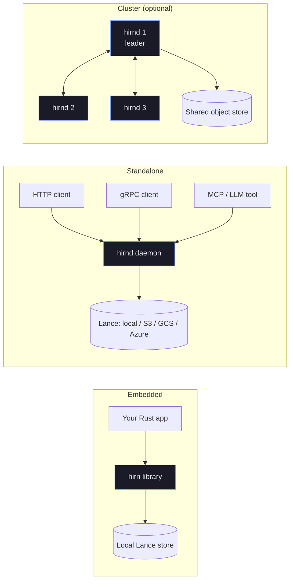

# Deployment & Operations
{: .no_toc }

hirn runs in two modes: **embedded** as a library inside your process, or
**standalone** as the `hirnd` daemon exposing HTTP, gRPC, and MCP. This section
covers running, operating, tuning, and debugging both.

## Deployment topology

## In this section

- **[Deployment](deployment.md)** — embedded vs standalone, the `hirnd` CLI, TLS,
  auth, and multi-node clusters.
- **[Admin Operations](admin-ops.md)** — snapshots, integrity checks, quarantine
  review, and GDPR erasure.
- **[Observability](observability.md)** — metrics, tracing, structured logs, and
  the OpenTelemetry pipeline.
- **[Performance Tuning](performance-tuning.md)** — index configuration, caching,
  token budgets, and throughput/latency knobs.
- **[Troubleshooting](troubleshooting.md)** — common failure modes and fixes.

## Related

- Lock down access in **[Security](security.md)**.
- Understand durability guarantees in **[Advanced → Write Guarantees](write-guarantees.md)**.
