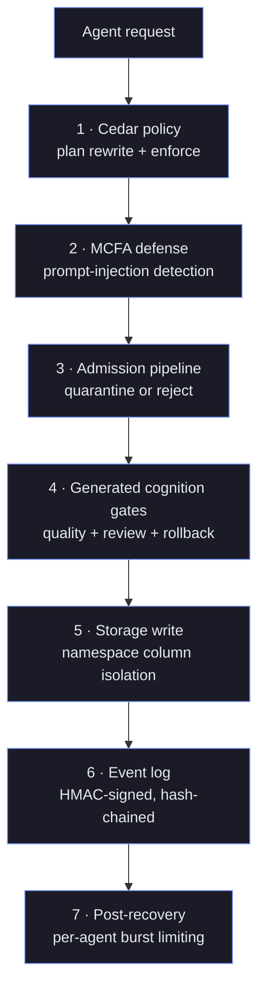
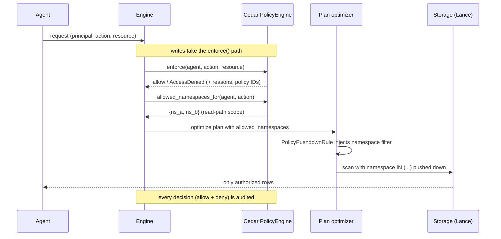
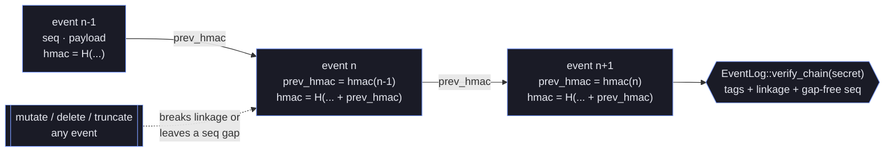

# Security Architecture
{: .no_toc }

> **⚠️ Experimental:** This project is under active development. APIs, on-disk formats, and behaviour may change without notice. Not recommended for production use.

## Table of contents
{: .no_toc .text-delta }

1. TOC
{:toc}

## In this section

- **[Cedar Guide](cedar-guide.md)** — how to write authorization policies:
  the entity model, actions, RBAC vs ABAC, realm isolation, and runtime
  policy management via HirnQL.
- **[Cedar Patterns](cedar-patterns.md)** — an operator-facing pattern
  library for the major action types, plus a production checklist.
- **[Encryption at Rest](encryption-at-rest.md)** — how to enable
  storage- and OS-delegated encryption per backend, plus event-log integrity.

## Threat Model

hirn is a shared, multi-agent memory substrate. The security design assumes that
**agents are semi-trusted at best** and that memory content is frequently
attacker-influenced (retrieved documents, tool output, user text). The controls
below defend against a concrete set of adversaries:

| Adversary | Goal | Primary control |
|-----------|------|-----------------|
| A compromised or misbehaving agent | Read or mutate memory outside its scope | Cedar authorization + namespace isolation |
| A prompt-injection payload embedded in stored content | Hijack a future agent's control flow | MCFA defense + input sanitization |
| A memory-poisoning campaign | Flood the store with near-duplicate or adversarial records | Admission pipeline + burst rate limiting |
| An insider tampering with history | Alter, delete, or truncate the audit trail | HMAC hash-chained event log and `_audit` trail |
| A cross-tenant escalation | Reach another tenant's realm | Realm isolation policies + fail-closed defaults |

{: .note }
> The threat model deliberately treats **content as untrusted data, never as
> instructions**. Sanitization (`sanitize_for_llm`) is applied to LLM prompt
> contexts; it is *not* used for database filters, which are protected by
> AST-level parameter binding instead. See [HirnQL Query Safety](#hirnql-query-safety).

## Defense in Depth

Hirn uses a defense-in-depth model with seven layers. Each layer is independent:
a bypass of one does not disarm the others, and every mutating request must clear
authorization, injection defense, admission, and audit before it becomes durable.

```
1. Cedar Policy (plan rewrite)   → namespace/classification filter injection
2. MCFA Defense (plan operator)  → prompt injection detection + audit
3. Admission Pipeline (pre-write)→ quarantine or reject
4. Generated Cognition Gates     → quality thresholds, review state, rollback receipts
5. Storage Write                 → namespace isolation via column filter
6. Event Log                     → HMAC-signed audit trail
7. Post-Recovery                 → per-agent burst rate limiting
```



{: .important }
> **Fail-closed by default.** Every enforcement point denies on absence of proof,
> not on presence of a block. If no `permit` policy matches, the request is denied.
> If no principal is set on the current task, `PolicyEnforcedStore` denies all
> operations. Cedar's baseline is *deny*, so a missing, malformed, or unloaded
> policy set fails safe rather than opening access. This is why authorization is
> a **plan property** (below) rather than an optional runtime check that could be
> skipped on an error path.

## Authorization: Plan-Rewrite Model

Authorization in hirn is a **plan property**, not a runtime gate. Cedar policies
are enforced via DataFusion optimizer rules that rewrite query plans. Engine code
uses `enforce()` for pre-mutation checks, while read-path authorization is handled
by automatic filter injection. Because the constraint is baked into the physical
plan, there is no execution path that reaches storage without it — a query either
carries its namespace filter or is replaced by `EmptyExec`.

The end-to-end decision flow for a request looks like this:



For read paths, the scope resolved by `allowed_namespaces_for` becomes the filter
the optimizer injects; for write paths, `enforce()` is a hard deny-before-write
gate. Both emit an audit event.

### hirn-policy Crate

All Cedar-related code lives in `hirn-policy`:

- **`PolicyEngine`** — Cedar authorization engine with entity management
- **Cedar entity model:** `Agent` ∈ `Team` ∈ `Organization`; `Namespace` ∈ `Realm`; `MemoryLayer`; `Operation`; `Tool`
- **18 actions:** `remember`, `correct`, `supersede`, `merge`, `retract`, `purge`, `recall`, `think`, `forget`, `consolidate`, `watch`, `connect`, `execute`, `admin`, `recall_raw_text`, `read`, `write`, `delete`
- **HMAC audit:** `compute_hmac()`, `verify_hmac()`, `derive_key()`, `canonical_audit_bytes()` — the keyed-hash primitives the engine uses to sign and hash-chain `_audit` entries when `event_hmac_secret` is configured
- **Open mode:** `PolicyEngine::open_mode()` and `PolicyEngine::load_from_brain_insecure_dev_mode()` permit all — explicit development/testing only

### PolicyPushdownRule

`PolicyPushdownRule` (in `hirn-exec::rules`) implements DataFusion's `PhysicalOptimizerRule`:

1. Reads `allowed_namespaces` from `HirnSessionExt` (registered in `SessionContext`)
2. If `None` — explicit open mode, no filter injected
3. If `Some([])` — deny all, replaces plan with `EmptyExec`
4. If `Some(["ns_a"])` — injects `Filter(namespace = 'ns_a')` above scans
5. If `Some(["ns_a", "ns_b"])` — injects `Filter(namespace IN ('ns_a', 'ns_b'))` above scans

Namespace access is pre-resolved via `PolicyEngine::allowed_namespaces_for(agent_id, action)` and
set on `HirnSessionExt` before plan optimization.

### NamespacePartitionPruneRule

`NamespacePartitionPruneRule` (in `hirn-exec::rules`) runs after `PolicyPushdownRule`:

- Simplifies single-element `IN (...)` predicates to equality (`=`) for more efficient Lance scan pushdown
- No-op when the filter is already an equality predicate or has multiple elements

### PolicyFilterExec

`PolicyFilterExec` (in `hirn-exec::operators`) handles residual Cedar predicates that
cannot be pushed to scan level (e.g., classification-based row filtering). Pass-through
when no residual predicate is configured.

### Pre-Mutation Enforcement

Mutating operations (`REMEMBER`, semantic `CORRECT` / `SUPERSEDE` / `MERGE MEMORY` /
`RETRACT`, destructive semantic `FORGET ... PURGE`, and `CONNECT`) call `enforce()`
before any data mutation. This is a deny-before-write check that returns
`HirnError::AccessDenied` with diagnostic reasons and policy IDs. The `enforce()`
method also logs an audit event for every authorization decision (both allow and deny).

## MCFA Defense

Memory Control-Flow Attack detection prevents prompt injection and memory poisoning
via `McfaDefenseExec` (in `hirn-exec::operators`):

### Detection Methods

| Method | Description |
|--------|-------------|
| **Pattern matching** | 21 known injection patterns (instruction override, persona hijack, system prompt leak, chat template delimiters). Case-insensitive substring matching. |
| **Length anomaly** | Content outside configurable bounds (min: 5, max: 50,000 bytes default). |
| **Template similarity** | Future: cosine similarity against known attack templates. |

### Write Path (Always On)

- `REMEMBER` plan always includes `McfaDefenseExec` as the first operator
- Flagged content is rejected before RPE scoring or storage
- Audit entry created in `mcfa_audit_log` dataset

### Read Path (Configurable)

- `RECALL` and `THINK` support `WITH MCFA_DEFENSE ON|OFF`
- When enabled, flagged memories are removed from the result set
- When disabled (default for reads), all memories pass through

### Audit Sink

`McfaAuditSink` trait records flagged content with:
- `memory_id` — ID of the flagged memory
- `content_snippet` — truncated content for review
- `flag_reason` — which detection method triggered
- `agent_id` — requesting agent
- `timestamp` — when the flag was raised
- `hmac` — integrity signature

### HirnOp Integration

`HirnOp::McfaDefense` in the plan compiler:
- Unconditionally emitted for `REMEMBER` (first stage, before RPE)
- Conditionally emitted for `RECALL`/`THINK` when `WITH MCFA_DEFENSE ON`

## Namespace Isolation

### Multi-Agent Isolation Model

hirn is designed for many agents sharing one physical store. Isolation is
expressed on two axes that compose:

- **Realm** — a hard tenancy boundary. A `Realm` groups namespaces and is the
  natural unit for multi-tenant deployments; cross-realm access is denied unless
  a policy explicitly permits it.
- **Namespace** — the row-level access scope within a realm. Every record carries
  a non-nullable `namespace` column, and reads are physically filtered to the
  caller's allowed set.

An agent's private memory (`Namespace::private_for(agent)` → `"private:agent_id"`)
is invisible to peers unless a policy grants cross-agent access, while `"shared"`
enables deliberate collaboration. Because the namespace predicate is pushed down
into the Lance scan, an unauthorized namespace is never even read from disk —
isolation is enforced at the storage layer, not filtered out after retrieval.

{: .warning }
> Namespace isolation depends on the caller's identity being trustworthy. In
> standalone (`hirnd`) deployments, the principal is derived from the request's
> authenticated identity — so the transport **must** authenticate callers
> (mTLS or a verified token). A forged or unauthenticated identity header would
> let a caller assert another agent's scope. See
> [Deployment & Operations](operations.md) for the transport auth model.

Every dataset includes a `namespace: Utf8` column (non-nullable). Namespace isolation
is enforced at multiple levels:

- **PolicyPushdownRule** — injects `namespace IN (...)` or `namespace = '...'` scan filters
- **RecallBuilder** — filters by namespace in vector search options
- **Lance scan filters** — namespace predicate pushed down to storage

### Namespace Types

| Constructor | Value | Use Case |
|-------------|-------|----------|
| `Namespace::default_ns()` | `"default"` | Single-agent default |
| `Namespace::shared()` | `"shared"` | Cross-agent collaboration |
| `Namespace::private_for(agent)` | `"private:agent_id"` | Agent-scoped isolation |

Namespace values are interned (`StringInterner`) for O(1) comparison. Pre-interned:
`"default"` (0), `"shared"` (1).

### Filter Injection Safety

Lance scan filters use string interpolation. **Always escape single quotes:**

```rust
let escaped = value.replace('\'', "''");
let filter = format!("namespace = '{escaped}'");
```

## Admission Control

Five-stage pipeline before `remember()` writes (short-circuit on first reject):

1. **SurpriseGate** — cosine distance to nearest memory; rejects if < 0.3 (too similar)
2. **DuplicateDetector** — near-duplicate rejection or merge (threshold 0.95)
3. **TokenBudgetGate** — per-agent token quota enforcement
4. **RateLimiter** — request frequency throttling per agent
5. **ContradictionGate** — LLM-based semantic conflict detection (optional)

Anomalous records → `QuarantineEntry` (status: `Pending` → `Approved`/`Rejected`).

## Generated Cognition Quality Gates

Offline cognition adds a second security boundary after raw admission: generated outputs do not become active knowledge until they pass typed review metadata and, when required, explicit approval.

### Review Contract

Dream hypotheses, reconcile proposals, and planning agendas carry `GeneratedCognitionReview` metadata with:

- `kind` — dream hypothesis, reconcile proposal, or planning agenda
- `quality_score` — operator-specific quality estimate
- `promotion_threshold` — the minimum score required for promotion
- `decision` — pending review, rejected by quality gate, approved, rejected, or rolled back
- `review_requirement` — whether human review is mandatory
- optional rollback receipt once the output has been promoted

### Default Thresholds

`HirnConfig` exposes per-operator thresholds instead of one global switch:

- `offline_dream_quality_threshold = 0.55`
- `offline_reconcile_quality_threshold = 0.60`
- `offline_plan_quality_threshold = 0.45`

These thresholds are validated in config and enforced by the offline scheduler runtime before approval can promote anything into the live semantic head set.

### Approval And Rollback

- `approve_quarantine()` refuses generated outputs that failed the quality gate.
- approved reconcile proposals record the prior semantic heads they replaced so a later rollback can restore the old active state safely.
- `rollback_quarantine_approval()` only succeeds while the affected logical memories have not advanced beyond the approved generated output.

Security implication: hirn treats offline synthesis as untrusted until it survives the same policy, review, and rollback controls operators can audit later.

## Audit Trail

- 18 auditable actions: `ShareMemory`, `Quarantine`, `CrossAgentMerge`, `AccessDenied`, etc.
- `EventEnvelope` wraps every event with: seq, timestamp, realm, namespace, agent_id
- Query via `RECALL EVENTS WHERE timestamp_ms >= <start>`
- `mcfa_audit_log` dataset stores MCFA defense triggers

## HMAC Integrity (hash-chained)

When `event_hmac_secret` is configured, both durable trails are signed **and
hash-chained** on the production write path:

- the `events` dataset (the event log), and
- the `_audit` dataset (the compliance audit trail: quarantine decisions,
  shares, purges, policy changes, …). Its entries are signed with a
  domain-separated key derived from the same secret via
  `hirn_policy::audit::derive_key`.

Without a configured secret, both trails are written unsigned and cannot be
verified.

- Each event carries an HMAC-SHA256 tag over `seq + timestamp + realm +
  namespace + agent_id + prev_hmac + payload`; each audit entry carries a
  keyed BLAKE3 tag over `seq + id + timestamp + actor + prev_hmac + action`.
- The `prev_hmac` field folds in the previous entry's tag, so each trail forms
  a Merkle-style chain. Mutating **or deleting/truncating** entries breaks the
  chain (a removed entry breaks its successor's linkage or leaves a `seq` gap).
- Per-event verification: `EventEnvelope::verify_hmac(secret)`.
- Full-chain verification (tags + linkage + gap-free sequence):
  `EventLog::verify_chain(secret)` for the event log and
  `db.admin().verify_audit_chain()` for the audit trail (which reports
  `Unsigned` when no secret is configured).
- Both chain heads are recovered on restart so signing continues unbroken.

Each event's tag folds in the previous event's tag, so the log is only valid as a
whole. This is what makes the trail **tamper-evident**: an attacker cannot mutate
one record, delete a record, or truncate the tail without breaking a downstream
link or leaving a `seq` gap that `verify_chain` detects.



{: .important }
> Tamper *evidence* is not tamper *prevention* and is not encryption. The chain
> proves the log has not been altered when you verify it with the secret; it does
> not stop an attacker with write access from deleting rows — it only guarantees
> such deletion cannot go undetected. Store `event_hmac_secret` outside the brain
> and verify the chain out-of-band. For confidentiality of data at rest, see
> [Encryption at Rest](encryption-at-rest.md).

## Memory Defense

- **Burst rate limiting:** per-agent sliding window (5 quarantines per 300s default)
- **Cold start guard:** anomaly scoring skipped when namespace has < 10 records
- **CorruptionDefense** state is serializable (`snapshot()`/`restore()`) for persistence

## Input Sanitization

`sanitize_for_llm(input)` strips chat template delimiters and instruction injections:
- `<|im_start|>`, `<|im_end|>` (ChatML)
- `[INST]`, `[/INST]` (Llama)
- `<<SYS>>`, `<</SYS>>` (Llama system)
- `### Instruction:`, `### Response:` (Alpaca)

Applied to LLM prompt contexts only — not database filters.

## HirnQL Query Safety

- **Parameterized queries are injection-safe.** `$`-parameters are bound at the
  AST level: a bound value is placed into the parsed statement's typed node, so
  it can never break out of a string literal to inject trailing clauses,
  regardless of contents. There is no textual `$name` substitution on the query
  string.
- **Serialization is faithful.** When a parsed statement is re-serialized (e.g.
  by the programmatic query builder), every string-bearing clause — including
  `NAMESPACE` — is quoted and escaped, and clauses are emitted in grammar order,
  so a round-tripped statement re-parses to an equal AST and cannot smuggle
  extra clauses through an unescaped value.
- **Cedar actions are enforced on the agent path.** Agent-scoped graph
  mutations (`connect`) enforce the corresponding Cedar action in the engine,
  not just namespace membership — matching the record-mutation paths.
