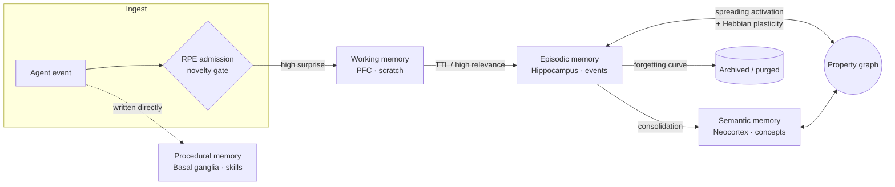

+++
title = "hirn"
description = "hirn is a cognitive memory engine for AI agents: graph-native long-term memory with spreading activation, symbolic temporal reasoning, Hebbian plasticity, and consolidation as database primitives. Embeddable, local-first, written in Rust."
template = "index.html"

[extra]
eyebrow = "Cognitive memory engine · Rust · Apache-2.0"
headline = "The brain an LLM never had"
subhead = "Persistent, structured memory for LLM agents — with biologically-grounded consolidation, graph reasoning, and per-agent isolation. One embeddable Rust library. No external services."

metrics_caption = "LongMemEval, full 500-question oracle protocol, gpt-4o reader and official judge. Every result is published with the control arm it was measured against — see <a href=\"/hirn/docs/benchmarks/\">Benchmarks</a>."

features_title = "Memory as a database problem"
features_lede = "The gap between an LLM with a vector store and an LLM with a brain is not a prompting problem. hirn makes recall, forgetting, and reasoning over time into engine primitives rather than application-layer glue."

closing_title = "Give an agent a brain"
closing_body = "Embedded mode is a single call and a local directory. No server, no cluster, no external dependency."

[[extra.metrics]]
value = "0.704"
label = "LongMemEval accuracy"
note = "vs 0.638 Zep · 0.944 Mem0"

[[extra.metrics]]
value = "+17"
label = "Temporal questions gained"
note = "paired McNemar, p = 0.0015"

[[extra.metrics]]
value = "4 layers"
label = "Working · episodic · semantic · procedural"
note = "CLS + CoALA aligned"

[[extra.metrics]]
value = "0 services"
label = "External dependencies"
note = "embedded, single process"

[[extra.features]]
title = "Four-layer memory"
body = "Working, episodic, semantic, and procedural stores that mirror human cognitive architecture, with biologically-grounded transitions between them."

[[extra.features]]
title = "Graph-native recall"
body = "Spreading activation, Personalized PageRank, and Hebbian edge plasticity run inside the engine — not as a post-processing pass over search results."

[[extra.features]]
title = "Symbolic temporal reasoning"
body = "Dates in retrieved text are resolved and their intervals computed in Rust, then handed to the reader as precomputed evidence. Date arithmetic is a documented LLM failure mode; hirn does not ask the model to do it."

[[extra.features]]
title = "Deep retrieval stack"
body = "IVF-HNSW and BM25 fused with reciprocal rank fusion, plus ColBERT MaxSim multivector reranking, over a Lance columnar lakehouse."

[[extra.features]]
title = "Consolidation and forgetting"
body = "Surprise-gated admission, RAPTOR-style summarisation, and a spaced-repetition forgetting curve that archives rather than deletes."

[[extra.features]]
title = "Authorization and audit"
body = "Cedar policies per operation, namespace isolation that fails closed without a principal, and a hash-chained tamper-evident audit trail."
+++

## Why an agent needs more than a vector store

LLMs are moving from stateless chatbots to long-running autonomous agents, and that shift
creates infrastructure gaps retrieval alone cannot close:

- **Memory beyond the context window** that survives restarts and grows without unbounded cost.
- **Structured reasoning over that memory** — causal chains, temporal ordering, associative recall.
- **Multi-agent isolation** with provenance and per-agent authorization.

A vector store answers "what text looks similar to this query?". An agent needs to answer
"what did I learn, when did I learn it, what has since changed, and what follows from it?".
Those are database questions, and hirn treats them as such.

## What it looks like

```rust
use hirn::{Hirn, HirnResult};
use hirn_core::types::AgentId;

#[tokio::main]
async fn main() -> HirnResult<()> {
    // Embedded mode: a local, single-process cognitive store.
    let brain = Hirn::open("./brain").await?;
    let agent = AgentId::new("agent-1")?;
    brain.register_agent(&agent, "My Agent").await?;
    let ctx = brain.as_agent(&agent).await?;

    ctx.remember_text("The Friday deployment failed due to config drift").await?;

    let hits = ctx.recall_text("why did the deploy fail?").limit(5).execute().await?;
    for hit in hits {
        println!("{}", hit.content());
    }
    Ok(())
}
```

## How the layers fit together

Memory flows between four stores through transitions modelled on human consolidation, with a
surprise gate deciding what is worth keeping at all.



Read the full model in [Cognitive Model](@/docs/concepts/cognitive-model.md), or the crate
layout and query pipeline in [Architecture](@/docs/concepts/architecture.md).

## Two ways to run it

| Mode | What it is | Use it for |
|---|---|---|
| **Embedded** | `Hirn::open("./brain")` — single process, zero configuration | Local agents, prototyping, tests |
| **Standalone** | The `hirnd` daemon over HTTP, gRPC, and MCP, fail-closed auth by default | Multiple clients, shared memory, services |

Both run the same engine. See [Deployment & Operations](@/docs/operations/_index.md).

## On the benchmark numbers

hirn publishes measured results with the control arm they were compared against, and states
plainly where it stands: **0.704 on LongMemEval**, ahead of Zep's published 0.638 and well
behind Mem0's 0.944. Retrieval containment is a retrieval metric and is never reported as
answer accuracy. Where a result is a null, it is recorded as a null.

The methodology, the artifacts, and the reasoning are in [Benchmarks](@/docs/benchmarks.md).
