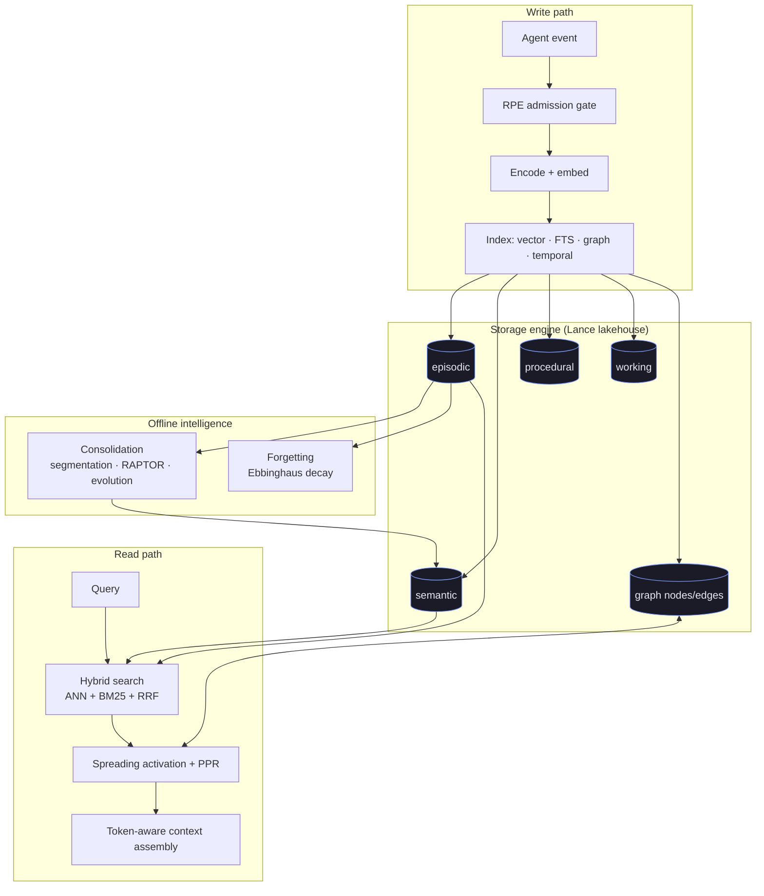

+++
title = "Concepts"
description = "The ideas behind hirn — a biologically-grounded four-layer memory model, the storage and query architecture, causal reasoning, and the write path."
weight = 2
sort_by = "weight"
template = "docs-section.html"
page_template = "docs-page.html"

[extra]
related = [
  "Query the model with the **[HirnQL Reference](@/docs/hirnql-reference.md)**.",
  "Understand durability in **[Advanced → Write Guarantees](@/docs/advanced/write-guarantees.md)**.",
]
+++

# Concepts

hirn is built on a small set of ideas borrowed from cognitive neuroscience and
modern retrieval research, implemented as **database primitives** rather than
application glue. This section explains the theory and how it maps to the engine.

## How the pieces fit

