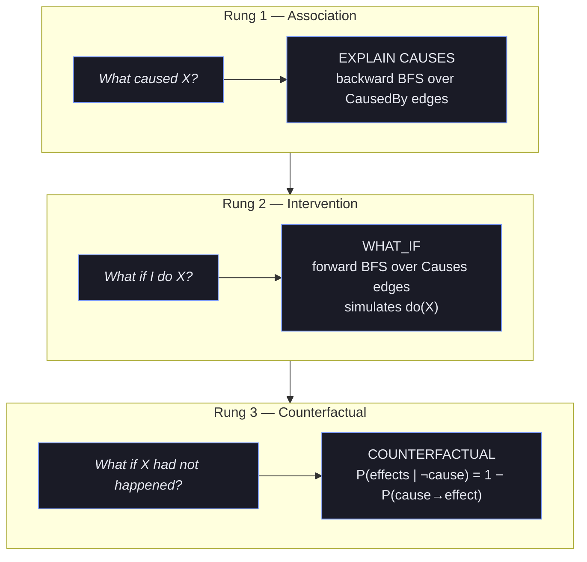
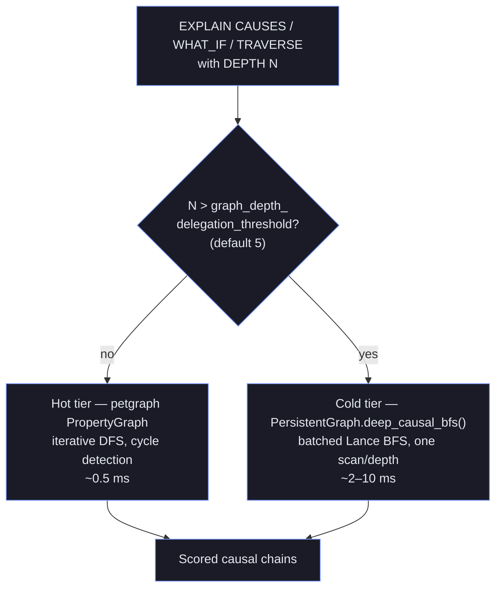

+++
title = "Causal Reasoning"
description = "Pearl's three-rung causal hierarchy — association, intervention, counterfactual — over hirn's property graph, plus deep traversal, NLI, and ABA conflict resolution."
weight = 3
+++

# Causal Reasoning


This project is under active development. APIs, on-disk formats, and behaviour may change without notice. Not recommended for production use.



Pearl's 3-rung causal hierarchy, operational in HirnQL.

## Why causal reasoning?

Similarity search answers "what is *like* this?" — but agents constantly need to answer "what
*caused* this?", "what would happen if I did this?", and "would this still have happened if that
had not?" Those are three fundamentally different questions, and no amount of nearest-neighbour
retrieval collapses them into one. Judea Pearl formalised the distinction as the **Ladder of
Causation** (Pearl, 2009; *The Book of Why*, 2018): three rungs of increasing inferential power,
each requiring strictly more than the one below. A system that only stores correlations lives on
rung 1 forever.

Hirn lifts memory onto all three rungs by treating causality as a first-class edge type on the
property graph rather than something re-derived at query time. Causal edges carry rich metadata —
strength, confidence, evidence count, confounders, mechanism — so a chain can be *scored*, not just
traversed. This page covers the three rungs, the HirnQL surface for each, the two-tier traversal
engine that keeps deep chains fast, and the conflict-resolution machinery (NLI + ABA) that keeps
the causal graph consistent.

See also: [Cognitive Model](@/docs/concepts/cognitive-model.md), [Architecture](@/docs/concepts/architecture.md), [HirnQL Reference](@/docs/hirnql-reference.md).

---

## Pearl's Causal Hierarchy

Hirn implements Judea Pearl's three rungs of the "Ladder of Causation". Each rung asks a strictly
harder question and, in hirn, compiles to a different traversal over the causal edges:




Each rung strictly subsumes the one below: intervention needs a causal model that mere association
cannot provide, and counterfactuals need the interventional model *plus* the observed outcome. Data
alone never lifts you up a rung — you need the causal structure, which is exactly what hirn's typed
`Causes` / `CausedBy` edges encode.



| Rung | Level | Question | HirnQL Statement | Operator |
|------|-------|----------|-------------------|----------|
| **1** | Association | _What caused X?_ | `EXPLAIN CAUSES` | `CausalQueryReadExec` |
| **2** | Intervention | _What if I do X?_ | `WHAT_IF` | `CausalQueryReadExec` |
| **3** | Counterfactual | _What if X had not happened?_ | `COUNTERFACTUAL` | `CausalQueryReadExec` |

### Rung 1 — Association (EXPLAIN CAUSES)

Finds backward causal chains to a target event. Traverses `CausedBy` edges from the target, enumerating all paths that lead to it. Each chain is scored by:

```
chain_score = Σ(strength × confidence × ln(1 + evidence_count)) / chain_length
```

### Rung 2 — Intervention (WHAT_IF)

Simulates Pearl's `do(X)` operator. Given a hypothetical intervention, follows forward `Causes` edges to estimate downstream effects. Returns:
- **Probability**: product of `strength × confidence` along each causal path
- **Affected memories**: all nodes reachable via causal chains from the intervention point
- **Mechanism path**: concatenation of edge mechanism descriptions

### Rung 3 — Counterfactual (COUNTERFACTUAL)

Evaluates "what would have happened if X had not occurred?" Finds the original event, traces its causal effects, and computes the counterfactual probability that dependent events would still hold without X.

---

## HirnQL Causal Statements

### EXPLAIN CAUSES

```sql
EXPLAIN CAUSES "target event description" [IN namespace] [DEPTH N]
```

- **target**: Substring match against memory content (case-insensitive)
- **DEPTH**: Maximum causal chain depth (default: 3)
- Returns `CausalQueryResult` with columns: `cause_id`, `cause_content`, `depth`, `edge_strength`, `edge_confidence`, `mechanism`, `chain_score`

**Example:**
```sql
EXPLAIN CAUSES "deployment failure" IN production DEPTH 5
```

### WHAT_IF

```sql
WHAT_IF "hypothetical intervention" [IN namespace] [DEPTH N]
```

- Follows forward `Causes` edges from matching memories
- Returns `CausalQueryResult` with columns: `effect_id`, `effect_content`, `depth`, `probability`, `mechanism_path`, `chain_score`

**Example:**
```sql
WHAT_IF "server capacity doubled" DEPTH 3
```

### COUNTERFACTUAL

```sql
COUNTERFACTUAL "event that might not have happened" [IN namespace] [DEPTH N]
```

- Computes `P(effects | ¬cause)` using `1 - P(cause → effect)`
- Returns `CausalQueryResult` with columns: `dependent_id`, `dependent_content`, `counterfactual_probability`, `original_probability`, `depth`

**Example:**
```sql
COUNTERFACTUAL "auto-scaling kicked in" DEPTH 4
```

---

## Deep Traversal Architecture

Hirn uses a **hybrid two-tier architecture** for graph traversal:

### Hot Tier — In-Memory PropertyGraph

- **Engine**: petgraph `StableDiGraph` wrapped in `CachedGraphStore`
- **Algorithm**: Iterative DFS with cycle detection
- **Latency**: Sub-millisecond (~0.5ms)
- **Use case**: Depth ≤ `graph_depth_delegation_threshold` (default: 5)
- **Location**: `hirn-engine::causal::causal_chain_backward()` / `causal_chain_forward()`

### Cold Tier — Batched Lance BFS

- **Engine**: `PersistentGraph::deep_causal_bfs()` on Lance 9.0 datasets
- **Algorithm**: Batched BFS (one Lance scan per depth level) → DFS over BFS results for chain enumeration
- **Latency**: ~2-10ms depending on depth and data volume
- **Use case**: Depth > `graph_depth_delegation_threshold`
- **Location**: `hirn-engine::persistent_graph::PersistentGraph::deep_causal_bfs()`

### Delegation Logic

The executor (`hirn-engine::ql::executor`) decides which tier to use:

```
if depth > config.graph_depth_delegation_threshold:
    → cold-tier: PersistentGraph.deep_causal_bfs()
else:
    → hot-tier: causal::causal_chain_backward() on PropertyGraph
```



This applies to both `EXPLAIN CAUSES` and `TRAVERSE` statements.


**Design rationale — why two tiers?** Shallow causal questions vastly outnumber deep ones, and the
in-memory petgraph answers them in sub-millisecond time without touching disk. But holding the
*entire* causal history in RAM does not scale, and deep chains would blow up a naive in-memory DFS.
Delegating only the deep traversals to a batched Lance BFS — one columnar scan per depth level —
keeps the common case fast while making the rare deep case *linear in depth* instead of exponential.
See the next section for why the obvious SQL alternative was rejected.



### Why Not UNION ALL of JOINs?

The lance-graph approach (UNION ALL of fixed-length JOIN chains) was evaluated and rejected:
- **Exponential plan size** at depth > 5 (each depth doubles the plan)
- Our batched BFS approach is **linear in depth**: exactly one Lance scan per BFS level
- PersistentGraph already implements `batch_bfs_filtered()` with frontier-based scanning

### TRAVERSE Deep Queries

```sql
TRAVERSE FROM "memory-id" [VIA relation] DEPTH N [WHERE ...] [LIMIT N]
```

When `DEPTH > threshold`:
- Uses `PersistentGraph.batch_bfs_filtered()` with optional `EdgeRelation` filter
- Batch-resolves all visited node IDs via `get_memories_batch()`
- Applies namespace isolation and WHERE filters

When `DEPTH ≤ threshold`:
- Uses per-node BFS with `get_edges()` calls on the persistent graph
- Incremental BFS with visited set tracking

---

## Causal Graph Model

### Edge Types

Causal edges carry rich metadata beyond simple weight:

| Field | Type | Description |
|-------|------|-------------|
| `strength` | `f32` | Causal strength [0, 1] |
| `confidence` | `f32` | Confidence in the causal relationship [0, 1] |
| `evidence_count` | `u32` | Number of observations supporting this edge |
| `mechanism` | `Option<String>` | Human-readable mechanism description |
| `confounders` | `Vec<String>` | Known confounding variables |
| `provenance` | `Provenance` | Origin and trust metadata |

### Relevance Score

```
relevance = strength × confidence × ln(1 + evidence_count)
```

### Key Edge Relations for Causality

- `Causes` — directed forward causal link (A causes B)
- `CausedBy` — directed backward causal link (B caused by A)
- `Contradicts` — bidirectional contradiction (detected by NLI)
- `Supports` — evidential support

---

## Causal Discovery During Consolidation

During the consolidation pipeline, the engine's `discover_causal_edges` step
(`hirn-engine/src/consolidation/pipeline.rs`) proposes new causal relationships. The
discovery signal in force **today** is a temporal co-occurrence heuristic — events that recur within
a time window, where one consistently precedes the other, produce a candidate edge (labelled
`temporal_granger`). Discovered edges are written to the graph with initial confidence based on
evidence strength.


Only the temporal co-occurrence heuristic is wired into the automatic pipeline right now. A true
lagged-predictability **Granger** test, **LLM** validation of suspected links, and **Bayesian**
evidence accumulation across observations are on the roadmap, not yet active stages. Treat any
`temporal_granger` edge as a *statistical co-occurrence hint*, not a verified causal claim.



The intended future shape of the discovery pipeline — with the roadmap stages shown dashed — is:

```mermaid
flowchart LR
  co["Temporal co-occurrence<br/>heuristic (active)"] --> edge["Candidate causal edge<br/>strength · confidence · evidence_count"]
  gr["Granger lagged test<br/>(roadmap)"] -.-> edge
  llm["LLM validation<br/>(roadmap)"] -.-> edge
  bayes["Bayesian accumulation<br/>(roadmap)"] -.-> edge
  edge --> graph[("Property graph")]
  classDef s fill:#1a1b26,stroke:#7c9cff,color:#e6e8f0;
  classDef road fill:#1a1b26,stroke:#5a5f7a,color:#9aa0b8,stroke-dasharray:4 3;
  class co,edge,graph s;
  class gr,llm,bayes road;
```

---

## Contradiction Detection

Contradiction handling runs in the engine's **imperative** paths, not as DataFusion
operators:

- **Write path (admission)**: the admission `ContradictionGate`
  (`hirn-engine/src/admission/controllers/contradiction.rs`) checks each new memory
  against existing ones and records `Contradicts` edges.

Insert-time detection deliberately splits **nomination** from **decision**:

1. `contradiction_candidates` runs on every write, using cheap surface signals —
   embedding similarity, negation-cue mismatch, shared entities, numeric divergence.
   None of these establishes a conflict; a negation cue fires on "the pipeline is
   *not* unstable" (which agrees with "the pipeline is stable") and stays silent on
   "the migration was rolled back" (which contradicts "the migration succeeded").
   They establish that a pair is *worth asking about*.
2. `confirm_contradictions` decides, using the configured entailment model
   (`NliModel` — an LLM judge or a local ONNX NLI cross-encoder). Only a
   `Contradiction` verdict at or above `nlu.contradiction_min_confidence` survives.

With no entailment model configured the nominations still stand, so offline
deployments keep detecting conflicts — but every edge records
`contradiction_signal` and `contradiction_decided_by` in its metadata, so an
unreviewed surface signal is never mistaken downstream for a model-confirmed
contradiction. See [Language Understanding](@/docs/concepts/language-understanding.md).
- **Recall**: the `WITH CONFLICTS` clause on `RECALL` surfaces contradiction
  annotations via the engine's `detect_conflicts_for_recall`.
- **Consolidation**: the consolidation pipeline's contradiction pass +
  `reconsolidation` module act on accumulated `Contradicts` edges.


Earlier revisions shipped a `NliContradictionExec` DataFusion operator (with a
heuristic/DeBERTa-MNLI classifier). It was never emitted into any compiled plan
and has been retired; the classifier had no other runtime consumer and was
removed with it. Contradiction detection now runs entirely on the imperative
paths above. NLI itself returned as `hirn_core::nlu::NliModel` — a first-class
trait consumed by insert-time confirmation and belief revision, rather than an
operator nothing emitted.



---

## ABA Conflict Resolution

Assumption-Based Argumentation resolves contradictions via a pure decision function
plus an engine apply-step (no DataFusion operator):

- **Decide**: `hirn_engine::resolve_aba` / `resolve_aba_multi` compute the grounded
  extension (winner/loser) and the loser's AGM-contracted confidence (minimal
  change: reduced, never zeroed).
- **Apply**: `CausalView::apply_aba_resolution` reduces the loser's importance,
  appends a successor revision, and records the reconsolidation metadata + audit.
- **Formal argumentation**: each memory is an argument with assumptions (source,
  recency, evidence count); AGM belief revision keeps the belief state consistent.


The former `AbaReconsolidationExec` operator was never emitted into a compiled
plan and has been retired; its decision algorithm was relocated into the engine
next to `apply_aba_resolution`.



---

## Topic Loom

The `topic_loom` Lance table persists per-topic associations written during
consolidation (Membox-inspired per-topic timelines with branch awareness).

> The `TopicLoomExec` DataFusion operator was retired (it had no `HirnOp` variant
> and was never placed in a plan). The `topic_loom` *dataset* is retained.

---

## Configuration Reference

| Parameter | Type | Default | Description |
|-----------|------|---------|-------------|
| `graph_depth_delegation_threshold` | `usize` | 5 | Depth at which traversal switches from hot-tier to cold-tier |
| `interference_consolidation_threshold` | `f32` | 0.3 | Cumulative interference score triggering consolidation |
| `interference_consolidation_cooldown_secs` | `u64` | 300 | Cooldown between consolidation triggers |
| `svo_confidence_threshold` | `f32` | 0.5 | Minimum confidence for SVO event extraction |
| `quality_gate_threshold` | `f32` | 0.5 | Quality gate scoring threshold for depth escalation |
