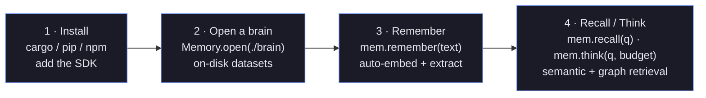
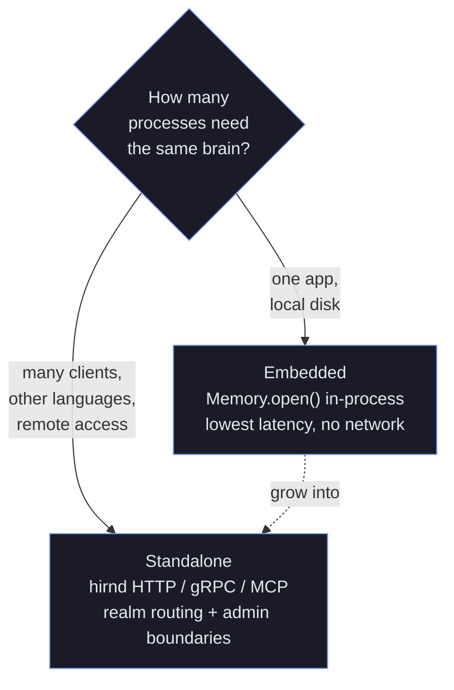

+++
title = "Getting Started"
description = "Install hirn and go from an empty brain to working cognitive memory in five minutes — remember, recall, and think in Rust, Python, or Node.js."
weight = 1
+++

# Getting Started with hirn

> 5 minutes to working cognitive memory — Rust, Python, or Node.js.

hirn is a cognitive memory engine that gives your AI agents persistent, structured memory with automatic consolidation, graph reasoning, and multi-agent isolation.

Think of it as the layer that turns a stateless LLM into an agent that *remembers*. Instead of stuffing an ever-growing transcript back into every prompt, you write facts and events into a "brain" once, and hirn decides — at query time — which of them are worth surfacing. It embeds text for semantic search, extracts entities into a property graph so related memories can pull each other into view, and consolidates raw events into durable knowledge in the background. The result is retrieval that behaves less like a keyword index and more like recall.

The fastest path to an intuition for the API is three calls: **install** the SDK for your language, **remember** a few things, then **recall** them with a natural-language question.




If you have used a vector database before, the mental model is familiar but wider: `remember` is your write, `recall` is your similarity search, and `think` is the piece a plain vector store does not give you — a budget-bounded context assembler that blends direct hits with graph- and causally-connected memories.


Before you dive into the examples, keep the runtime model in mind:

- **Online path:** remember, recall, and think stay latency-bounded and optimize for fast retrieval.
- **Offline path:** dream, reconcile, and planning operators run as explicit budgeted jobs instead of hiding in user-facing requests.
- **Resource path:** non-text evidence is stored as first-class resources with explicit preview/full hydration, not as ad hoc inline blobs.

## Choose Your Route

If you are skimming for the right surface instead of reading this guide front to back, use the navigation sidebar. The short version:

| Goal | Open next |
|------|-----------|
| Build your first app | stay here, then jump to [hirnql-reference.md](@/docs/hirnql-reference.md) |
| Explain retrieval or write-path decisions | [explanation-surfaces.md](@/docs/advanced/explanation-surfaces.md) |
| Schedule heavy reasoning safely | [offline-intelligence.md](@/docs/advanced/offline-intelligence.md) |
| Run hirn in production | [deployment.md](@/docs/operations/deployment.md), [observability.md](@/docs/operations/observability.md), [troubleshooting.md](@/docs/operations/troubleshooting.md) |
| Understand internals and tradeoffs | [architecture.md](@/docs/concepts/architecture.md) |

---

## Installation

### Rust

Add to your `Cargo.toml`:

```toml
[dependencies]
hirn = "0.2"
tokio = { version = "1", features = ["full"] }
```

### Python

```bash
pip install hirn
```

### Node.js

```bash
npm install @hupe1980/hirn
```

---

## 1. Open a Brain

A "brain" is a directory where hirn stores all memory data (Lance datasets, graph, policies, audit trail).

### Rust

```rust
use hirn::prelude::*;

#[tokio::main]
async fn main() -> HirnResult<()> {
    let memory = HirnMemory::open("./my-brain").await?;
    // Ready to use — embedding provider auto-detected from environment.
    Ok(())
}
```

### Python

```python
from hirn import Memory

mem = Memory.open("./my-brain")
```

### Node.js

```js
const { Memory } = require('@hupe1980/hirn');

const mem = Memory.open('./my-brain');
```

**Provider discovery:** hirn auto-detects embedding providers from environment variables:

| Variable | Effect |
|----------|--------|
| `OPENAI_API_KEY` | Uses OpenAI embeddings + LLM |
| `OLLAMA_HOST` | Uses Ollama embeddings + LLM |
| *(none)* | Falls back to `PseudoEmbedder` (testing/local dev) |

---

## 2. Store Memories

### Rust

```rust
// Simple — auto-embeds and extracts entities
memory.remember("The deployment succeeded with zero downtime").await?;
memory.remember("User prefers dark mode and vim keybindings").await?;
memory.remember("API latency dropped 40% after CDN rollout").await?;
```

### Python

```python
mem.remember("The deployment succeeded with zero downtime")
mem.remember("User prefers dark mode and vim keybindings")
mem.remember("API latency dropped 40% after CDN rollout")
```

### Node.js

```js
await mem.remember('The deployment succeeded with zero downtime');
await mem.remember('User prefers dark mode and vim keybindings');
await mem.remember('API latency dropped 40% after CDN rollout');
```

---

## 3. Recall Memories

Semantic search finds memories relevant to your query:

### Rust

```rust
let results = memory.recall("What happened with the deployment?", 5).await?;
for r in &results {
    println!("[{:.2}] {}", r.similarity, r.record.content());
}
```

### Python

```python
results = mem.recall("What happened with the deployment?", limit=5)
for r in results:
    print(f"[{r.similarity:.2f}] {r.content}")
```

### Node.js

```js
const results = await mem.recall('What happened with the deployment?', 5);
for (const r of results) {
    console.log(`[${r.similarity.toFixed(2)}] ${r.content}`);
}
```

---

## 4. Think — Assemble LLM Context

`think()` assembles the optimal context for an LLM prompt within a token budget. It combines working memory, direct recall, graph-connected memories, and causal chains:

### Rust

```rust
let ctx = memory.think("How should we improve performance?", 2048).await?;
println!("Context ({} tokens):\n{}", ctx.token_count, ctx.context);
// Pass ctx.context to your LLM as system/user context
```

### Python

```python
ctx = mem.think("How should we improve performance?", budget=2048)
print(f"Context ({ctx.token_count} tokens):\n{ctx.context}")
```

### Node.js

```js
const ctx = await mem.think('How should we improve performance?', 2048);
console.log(`Context (${ctx.tokenCount} tokens):\n${ctx.context}`);
```

---

## 5. Store Resource-Backed Evidence

First-class resources let you remember and hydrate the real artifact, not only a text summary about it.

### Rust

```rust
use hirn::prelude::*;
use hirn::resource::{DerivedArtifactKind, EvidenceRole, HydrationMode};

let agent = AgentId::new("ops").unwrap();
memory.db().register_agent(&agent, "Ops").await?;

let screenshot = EpisodicRecord::builder()
    .content("Checkout failed in staging")
    .agent_id(agent)
    .multi_content(MemoryContent::Image {
        data: png_bytes,
        mime_type: "image/png".into(),
        description: "checkout page showing a card declined banner".into(),
    })
    .build()?;

let id = memory.db().episodic().remember(screenshot).await?;
let query = memory.db().embed_text("card declined checkout screenshot").await?;
let recalled = memory
    .db()
    .recall_view()
    .query(query)
    .agent_id(agent.as_str())
    .limit(3)
    .execute()
    .await?;

let source = recalled
    .iter()
    .find(|result| result.record.id() == id)
    .and_then(|result| {
        result.resource_evidence.iter().find(|summary| {
            summary.role == EvidenceRole::Source && summary.artifact_kind.is_none()
        })
    })
    .expect("resource evidence should be present");

assert!(source.available_artifacts.contains(&DerivedArtifactKind::Thumbnail));

let preview = memory
    .db()
    .recall_view()
    .fetch_resource(&agent, source.resource_id, HydrationMode::Preview)
    .await?
    .expect("preview hydration should resolve the resource");
assert!(preview.artifacts.iter().any(|artifact| {
    artifact.kind == DerivedArtifactKind::Thumbnail
}));
```

See [resource_memory.rs](https://github.com/hupe1980/hirn/blob/main/crates/hirn/examples/resource_memory.rs) for the full runnable workflow.

Hydration modes are intentionally explicit:

- `HydrationMode::MetadataOnly` returns identity, modality, lifecycle, and artifact availability only.
- `HydrationMode::Preview` adds preview-capable artifacts such as captions, previews, transcripts, or thumbnails without loading the original blob.
- `HydrationMode::Full` includes the underlying payload when the caller is allowed to read raw resource content. Policy typically requires `RecallRawText` in addition to `Recall` for that step.

When a recalled memory has `resource_evidence`, treat it as a stable reference graph: the source resource, generated artifacts, and transformed summaries are different provenance surfaces and can be hydrated independently.

## 6. Offline Intelligence (Optional Advanced)

The offline cognition layer is for expensive reasoning you want to budget, inspect, and potentially roll back later.

```rust
use hirn::prelude::*;
use hirn_core::{CognitiveJob, CognitiveJobKind, OfflineJobTarget, OperatorBudget};

let target = OfflineJobTarget {
    namespace: Some(Namespace::default_ns()),
    topic: Some("checkout".into()),
    ..Default::default()
};

let job = CognitiveJob {
    budget: OperatorBudget {
        wall_clock_limit_ms: 30_000,
        token_limit: 4_000,
        provider_spend_limit_usd: 0.25,
        max_result_volume: 16,
    },
    rationale: Some("nightly dream pass for checkout incidents".into()),
    ..CognitiveJob::new(CognitiveJobKind::Dream, target)
};

let job_id = memory.db().admin().schedule_offline_job(job).await?;
let inspection = memory
    .db()
    .admin()
    .inspect_offline_job(job_id)
    .await?
    .expect("scheduled job should exist");

println!("latest status: {:?}", inspection.latest.status);
```

Offline outputs are deliberately provisional:

- dream jobs generate quarantined hypotheses
- reconcile jobs generate typed repair proposals with policy snapshots
- planning jobs generate agenda proposals with support refs, evidence resources, and gaps
- low-quality outputs remain quarantined, and approved generated outputs can be rolled back if a later review rejects them

See [offline-intelligence.md](@/docs/advanced/offline-intelligence.md) for the runtime model and operator workflow.

### Beliefs & Reflection

Beliefs are semantic records whose `confidence` is a subjective credence
rather than an extraction score. The `Reflect` operation classifies a new
evidence record against the nearest beliefs in the same namespace and adjusts
their credence traceably: reinforcing evidence nudges confidence toward 0.99,
weakening evidence toward 0.05, and contradicting evidence halves it while
recording a `Contradicts` relationship. Every adjustment is an appended
revision carrying the rationale and the evidence id, so
`db.semantic().history(...)` shows the full epistemic trajectory. With an
`LlmProvider` the judgment is LLM-based (strictly parsed); without one, a
negation-marker heuristic covers the reinforce/contradict cases.

```rust
// Hold a belief with an initial credence.
let belief = SemanticRecord::builder()
    .concept("deploys-safe")
    .description("our deploy pipeline is safe to run on Fridays")
    .belief()
    .confidence(0.8)
    .agent_id(agent_id)
    .build()?;
memory.db().semantic().store(belief).await?;

// New experience arrives as episodic evidence...
let evidence_id = memory.db().episodic().remember(incident_episode).await?;

// ...and reflection revises the belief (here: contradicts → 0.8 → 0.4).
for update in memory.db().semantic().reflect(evidence_id).await? {
    println!(
        "{}: {} {:.2} -> {:.2} ({})",
        update.belief_id,
        update.outcome,
        update.prior_confidence,
        update.new_confidence,
        update.rationale
    );
}
```

The same sweep runs offline as `CognitiveJobKind::Reflect`, scoped to a
namespace and bounded by the job's `temporal_window` and budget. See
[cognitive-model.md](@/docs/concepts/cognitive-model.md#beliefs-reflection) for the
confidence dynamics table and audit-trail details.

## 7. Inspect Explanations

hirn exposes structured explanation surfaces for both retrieval and the write path.

- `RecallBuilder::execute_with_explanation()` returns results plus score breakdowns, suppression summaries, policy scope, and latency diagnostics.
- `ThinkBuilder::execute_with_explanation()` adds context-budget inclusion/exclusion details on top of the retrieval explanation.
- `EpisodicView::remember_with_explanation()` returns `RememberExplanation` on success and `RememberFailure` on rejection, including fast/slow-path routing and interference decisions.

Use the explanation surfaces when you need auditable behavior for a UI, evaluation harness, or operator workflow. See [explanation-surfaces.md](@/docs/advanced/explanation-surfaces.md) for the full contract.

## 8. HirnQL — Query Language

hirn includes a domain-specific query language for advanced operations:

### Rust

```rust
// Store via HirnQL
memory.query(r#"REMEMBER episode CONTENT "Cache hit rate reached 98%" TYPE observation IMPORTANCE 0.8"#).await?;

// Recall with filters
memory.query(r#"RECALL episodic ABOUT "cache performance" WHERE importance > 0.7 LIMIT 5"#).await?;

// Graph traversal
memory.query(r#"RECALL episodic ABOUT "system issues" EXPAND GRAPH DEPTH 2 ACTIVATION spreading LIMIT 10"#).await?;
```

### Python

```python
mem.query('RECALL episodic ABOUT "system issues" WHERE importance > 0.7 LIMIT 5')
```

### Node.js

```js
await mem.query('RECALL episodic ABOUT "system issues" WHERE importance > 0.7 LIMIT 5');
```

See [hirnql-reference.md](@/docs/hirnql-reference.md) for the complete language reference.

---

## 9. Clean Up

### Rust

The database is closed when `HirnMemory` is dropped.

### Python

```python
mem.close()
# Or use a context manager:
with Memory.open("./my-brain") as mem:
    mem.remember("something")
```

### Node.js

```js
mem.close();
```

---

## Next Steps

Now that the core loop works, the docs fan out in a few directions depending on what you are building:

- **[Concepts](@/docs/concepts/_index.md)** — the ideas behind hirn: the four-layer memory model, storage architecture, and the write path
- **[Cognitive Model](@/docs/concepts/cognitive-model.md)** — why working, episodic, semantic, and procedural memory are separate tiers, and what fires the transitions between them
- **[Deployment & Operations](@/docs/operations/_index.md)** — running embedded, as the `hirnd` daemon, or as a cluster
- **[HirnQL Reference](@/docs/hirnql-reference.md)** — full query language documentation
- **[Security Architecture](@/docs/security/_index.md)** — the defense-in-depth model, MCFA injection defense, and namespace isolation
- **[Cedar Policy Guide](@/docs/security/cedar-guide.md)** — authorization policies for multi-agent/multi-tenant setups
- **[Architecture Guide](@/docs/concepts/architecture.md)** — deep dive into hirn's internals
- **[Offline Intelligence](@/docs/advanced/offline-intelligence.md)** — scheduler, budgets, dream/reconcile/plan workflow
- **[Explanation Surfaces](@/docs/advanced/explanation-surfaces.md)** — retrieval and write-path reasoning surfaces
- **[Benchmarks](@/docs/benchmarks.md)** — H1–H6 cognitive benchmark results
- **[Examples](https://github.com/hupe1980/hirn/blob/main/crates/hirn/examples/)** — runnable example projects
- **[Resource Memory Example](https://github.com/hupe1980/hirn/blob/main/crates/hirn/examples/resource_memory.rs)** — end-to-end resource ingest, recall, and preview hydration


A good next reading order for most people is [Concepts](@/docs/concepts/_index.md) → [Cognitive Model](@/docs/concepts/cognitive-model.md) → [HirnQL Reference](@/docs/hirnql-reference.md), then [Deployment & Operations](@/docs/operations/_index.md) once you are ready to run hirn beyond a single process.


### Deployment

Everything above runs **embedded** — hirn lives inside your process and reads and writes a local brain directory. That is the right default for a single application, a notebook, or a CLI agent. When you need multiple processes, other languages, or network access to the same memory, you promote the same brain to a **standalone** daemon (`hirnd`) that speaks HTTP, gRPC, and MCP. The memory model and HirnQL semantics are identical across both modes; only the transport and ownership boundaries change.



For production deployments, start with [deployment.md](@/docs/operations/deployment.md) and [operations.md](@/docs/operations/_index.md), then wire in [observability.md](@/docs/operations/observability.md) and keep [troubleshooting.md](@/docs/operations/troubleshooting.md) nearby. The [README](https://github.com/hupe1980/hirn/blob/main/README.md#deployment-modes) also summarizes the deployment modes:

- **Embedded** — `HirnMemory::open()` in your process
- **Standalone** — `hirnd` HTTP/gRPC/MCP daemon

> **Note:** Distributed and admin operations — realm routing, cross-realm recall, and cluster ownership — live on the daemon surface, not in embedded HirnQL. See [HirnQL Reference](@/docs/hirnql-reference.md) for the exact embedded runtime boundary.
