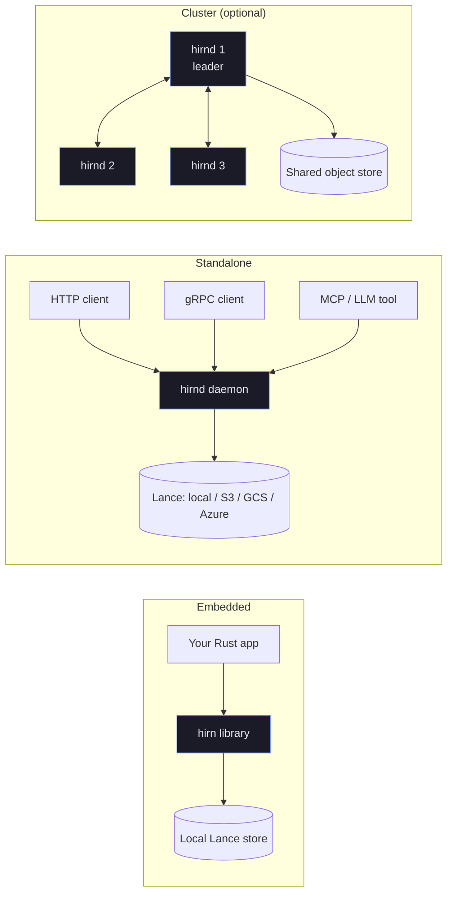

+++
title = "Deployment & Operations"
description = "Running hirn in production — deployment modes, administration, observability, performance tuning, and troubleshooting."
weight = 4
sort_by = "weight"
template = "docs-section.html"
page_template = "docs-page.html"

[extra]
related = [
  "Lock down access in **[Security](@/docs/security/_index.md)**.",
  "Understand durability guarantees in **[Advanced → Write Guarantees](@/docs/advanced/write-guarantees.md)**.",
]
+++

# Deployment & Operations

hirn runs in two modes: **embedded** as a library inside your process, or
**standalone** as the `hirnd` daemon exposing HTTP, gRPC, and MCP. This section
covers running, operating, tuning, and debugging both.

## Deployment topology

