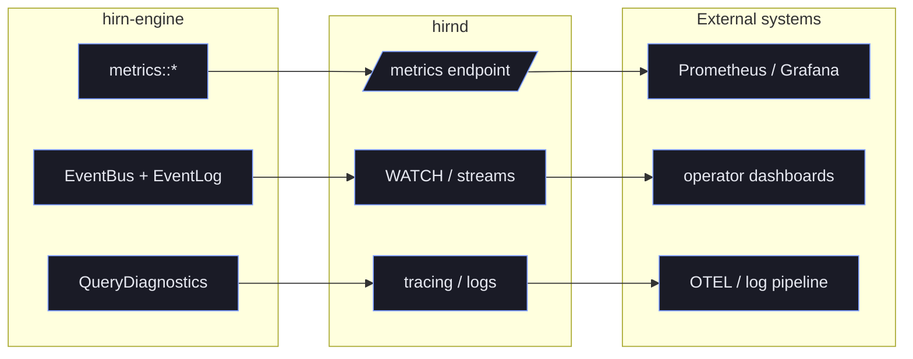

+++
title = "Observability"
description = "Metrics, durable events, and query diagnostics for hirn — the surfaces that tell you whether the fleet is healthy, what changed, and why a request behaved so."
weight = 3
+++

# Observability Guide

hirn exposes three observability surfaces that work together:

- **metrics** for fleet health and regressions
- **events** for mutation history and streaming workflows
- **diagnostics** for explaining one request, one query, or one operator run

State-of-the-art memory systems need all three. Metrics tell you that recall quality or latency changed. Events tell you what changed in storage and cognition. Diagnostics explain why one specific request behaved the way it did.

## When To Use Which Surface

| Question | Best Surface | Why |
|----------|--------------|-----|
| Is the cluster healthy right now? | Metrics | Fast aggregate health and alerting |
| What happened to this job or memory? | Events + durable event log | Ordered history with replay |
| Why did this recall or think result look the way it did? | Query diagnostics + explanation surfaces | Request-scoped timings, suppression, and policy context |
| Why is grounded evidence packaging slower today? | Preview-package metrics + diagnostics | Separates seeded-preview reuse from refetch/hydration paths |

## Architecture

```text
┌────────────────────┐        ┌────────────────────┐        ┌─────────────────────┐
│ hirn-engine        │        │ hirnd              │        │ External systems    │
│                    │        │                    │        │                     │
│ metrics::*         │──────▶ │ /metrics           │──────▶ │ Prometheus / Grafana│
│ EventBus           │──────▶ │ WATCH / streams    │──────▶ │ operator dashboards │
│ QueryDiagnostics   │──────▶ │ tracing / logs     │──────▶ │ OTEL / log pipeline │
│ EventLog append    │        │                    │        │                     │
└────────────────────┘        └────────────────────┘        └─────────────────────┘
```

The same picture as a signal-flow pipeline — three producers inside the engine,
three exit surfaces on the daemon, and three destinations in your telemetry stack:



Read the pipeline top to bottom when triaging: **metrics** flag that something
changed, **events** tell you what mutated in storage and cognition, and
**diagnostics** explain why one specific request behaved the way it did. You
almost always move left-to-right through those three surfaces during an incident.

The observability implementation lives in `hirn-engine::observability` and is split into focused modules:

| Module | Purpose |
|--------|---------|
| `metrics` | metric names and helper instrumentation for counters, gauges, and histograms |
| `event` | `MemoryEvent` enum and in-process broadcast stream |
| `event_log` | append-only durable event history stored in Lance |
| `diagnostics` | `QueryDiagnostics`, timing capture, and slow-query reporting |
| `trace` | provenance and lineage inspection for audit workflows |

## Metrics

hirn uses the [`metrics`](https://docs.rs/metrics) facade. In practice that means:

- `hirnd` can expose Prometheus metrics directly
- libraries can run with a no-op recorder when metrics export is not configured
- the same instrumentation feeds both online paths and offline cognition

### Core Request Counters

| Metric | Labels | Description |
|--------|--------|-------------|
| `hirn_remember_total` | `realm`, `status` | total remember/write attempts |
| `hirn_recall_total` | `realm`, `status` | total recall requests |
| `hirn_consolidation_total` | none | total consolidation runs |
| `hirn_admission_rejected_total` | `realm` | writes rejected by admission logic |
| `hirn_authz_decisions_total` | `decision=allow|deny` | Cedar authorization decisions |
| `hirn_compaction_total` | none | storage compaction passes |

### Latency Histograms

| Metric | Labels | Description |
|--------|--------|-------------|
| `hirn_recall_duration_seconds` | `realm` | recall latency |
| `hirn_store_duration_seconds` | `realm` | remember/write latency |
| `hirn_consolidation_duration_seconds` | none | consolidation duration |
| `hirn_authz_latency_seconds` | none | Cedar evaluation latency |
| `hirn_embedding_latency_seconds` | none | provider embedding latency |
| `hirn_offline_job_duration_seconds` | `kind`, `status` | dream/reconcile/plan execution duration |
| `hirn_preview_package_resolution_seconds` | `surface`, `path` | grounded-preview packaging latency |

### Offline Cognition Counters

Use these to answer whether the scheduler is making progress or failing silently.

| Metric | Labels | Description |
|--------|--------|-------------|
| `hirn_offline_job_submitted_total` | `kind` | jobs accepted by the scheduler |
| `hirn_offline_job_completed_total` | `kind` | jobs completed successfully |
| `hirn_offline_job_failed_total` | `kind` | jobs that terminated in failure |
| `hirn_offline_job_skipped_total` | `kind`, `reason` | jobs skipped by budget, policy, or runtime decisions |

### Language-Understanding Counters

Meaning-dependent decisions (query routing, belief revision, knowledge typing,
contradiction, extraction) run through an ordered model chain with a deterministic
fallback — see [Language Understanding](@/docs/concepts/language-understanding.md). These metrics
exist so a silently-degraded deployment is visible: a provider that times out on
every call otherwise looks identical to one that is working, with quality quietly
reverting to the fallback.

| Metric | Labels | Description |
|--------|--------|-------------|
| `hirn_nlu_decisions_total` | `task`, `source` | decisions by deciding backend; `source="heuristic"` **is the fallback rate** |
| `hirn_nlu_abstentions_total` | `task`, `backend`, `reason` | backend declined to decide (`timeout`, `malformed_output`, `low_confidence`, `provider_error`, …) |
| `hirn_nlu_decision_seconds` | `task` | end-to-end decision latency including the fallback chain |
| `hirn_nlu_confidence` | `task`, `source` | calibrated confidence of accepted decisions; compare against measured accuracy to check calibration |

**Alert on the fallback rate**, not just on provider errors:

```
sum(rate(hirn_nlu_decisions_total{source="heuristic"}[5m]))
  / sum(rate(hirn_nlu_decisions_total[5m])) > 0.5
```

A sustained jump means model-backed understanding has stopped and the deterministic
floor is answering. `hirn_nlu_abstentions_total`'s `reason` label says why.

### Gauges

| Metric | Labels | Description |
|--------|--------|-------------|
| `hirn_memory_count` | none | total memories across all layers |
| `hirn_graph_node_count` | none | hot-tier graph nodes |
| `hirn_graph_edges_total` | `realm` | hot-tier graph edge count |
| `hirn_recall_candidates` | none | candidate count returned by the most recent recall path |
| `hirn_storage_bytes` | `realm` | storage footprint |
| `hirn_event_log_seq` | `realm` | durable event-log high-water mark |
| `hirn_policy_count` | none | loaded Cedar policy count |
| `hirn_provider_fallback_total` | `realm`, `provider_type` | graceful-degradation fallback count |
| `hirn_compaction_fragments_removed` | none | fragments removed in the last compaction pass |
| `hirn_compaction_fragments_added` | none | fragments added in the last compaction pass |
| `hirn_compaction_datasets` | none | datasets touched in the last compaction pass |
| `hirn_compaction_memories_archived` | none | memories archived in the last compaction pass |
| `hirn_offline_job_queue_depth` | none | jobs currently queued |
| `hirn_offline_job_running` | none | jobs currently executing |
| `hirn_offline_job_completed` | none | jobs completed since process start |
| `hirn_offline_job_failed` | none | jobs failed since process start |
| `hirn_offline_job_skipped` | none | jobs skipped since process start |

### Grounded Evidence Preview Metrics

Grounded JSON evidence packaging exposes a dedicated path metric because preview reuse is supposed to be cheaper than re-hydrating the same evidence later in the pipeline.

| Metric | Labels | Description |
|--------|--------|-------------|
| `hirn_preview_package_path_total` | `surface=recall|think`, `path=seeded_reuse|hydrated_refetch` | which preview resolution path was taken |

Interpretation:

- `path=seeded_reuse` should stay materially cheaper than `path=hydrated_refetch`
- a rising `hydrated_refetch` share usually means later JSON packaging needs more preview data than earlier rerank/seed phases retained
- compare `surface=recall` and `surface=think` independently because both use the same shared preview owner in `hirn-engine::resource_presentation`

### Scraping

`hirnd` exposes Prometheus metrics at `GET /metrics`:

```bash
curl http://localhost:8080/metrics
```

Example Prometheus configuration:

```yaml
scrape_configs:
  - job_name: hirn
    static_configs:
      - targets: ['localhost:8080']
    scrape_interval: 15s
```

## Events

Every database mutation emits a `MemoryEvent` through an in-process event bus (`tokio::broadcast`). These events are for live subscribers. The same high-value history is also appended to the durable `events` dataset for replay and audit.

### Event Categories

| Category | Variants |
|----------|----------|
| Memory lifecycle | `EpisodeCreated`, `SemanticCreated`, `WorkingPushed`, `ImportanceUpdated`, `Reconsolidated`, `Archived`, `Forgotten` |
| Graph | `EdgeCreated`, `EdgeWeightUpdated`, `CausalEdgeDiscovered` |
| Consolidation | `Consolidated`, `ContradictionDetected` |
| Admission | `AdmissionEvaluated` |
| Authorization | `AccessGranted`, `AccessDenied`, `PolicyChanged` |
| Compaction | `CompactionCompleted` |
| Recall | `MemoryRecalled` |
| Dream | `HypothesisGenerated`, `HypothesisValidated`, `HypothesisDiscarded` |
| System | `SnapshotTaken`, `Error`, `Unknown` |

Dream events matter operationally because they separate provisional generation from validated or discarded output. If you only look at completed offline jobs, you miss whether the hypotheses were later approved, superseded, or rejected.

### Subscribing

```rust
let mut rx = db.subscribe();
while let Ok(event) = rx.recv().await {
    println!("{:?}", event);
}

let mut contradictions = db.subscribe_filtered(|event| {
    matches!(event, MemoryEvent::ContradictionDetected { .. })
});
```

### Durable Event Log

The `EventLog` persists every event as an `EventEnvelope` in the `events` dataset.

It is designed for forensic and replay use cases, not only live dashboards:

- monotonic sequence numbers for ordered replay
- range, time-window, and criteria-based reads
- snapshot support for faster recovery
- retention and compaction policies for bounded history cost


When `event_hmac_secret` is configured, event-log entries are HMAC-signed and
hash-chained, making the audit trail tamper-evident. Verify the integrity of the
chain with `EventLog::verify_chain`. See [Security](@/docs/security/_index.md) for the audit
and integrity model.


For offline cognition, use the durable `offline_jobs` dataset together with the durable event log: `offline_jobs` explains one job lifecycle, while `events` gives you surrounding system context.

### HirnQL WATCH

```sql
WATCH IN "my-namespace"
```

Use `WATCH` for operator consoles, live debugging, and workflow automation that needs to react to new events as they happen.

## Query Diagnostics

Every recall or think execution can capture `QueryDiagnostics`, which gives the timing and volume breakdown for the query pipeline.

| Field | Description |
|-------|-------------|
| `query_id` | ULID-based unique query identifier |
| `authorize_us` | Cedar evaluation time in microseconds |
| `embed_ms` | embedding generation time |
| `vector_search_ms` | Lance vector-search time |
| `graph_expand_ms` | graph activation and expansion time |
| `rerank_ms` | scoring and reranking time |
| `neural_rerank_ms` | cross-encoder reranking time when enabled |
| `records_scanned` | total records scanned |
| `records_returned` | total records returned |

These diagnostics also flow into the explanation surfaces. That means an operator UI can show both the answer and the reasoning envelope without scraping metrics separately.

### EXPLAIN ANALYZE

```sql
EXPLAIN ANALYZE RECALL "query" IN "namespace" LIMIT 10
```

Use this when the problem is plan shape or operator cost, not business correctness. `EXPLAIN ANALYZE` is the fastest way to see where one query spent time.

### Slow Query Detection

Slow operations are emitted through `tracing::warn` with request context. Start there when you need one bad query or one bad consolidation pass, not a fleet-wide latency average.

## Provenance Tracing

Trace surfaces answer a different question from metrics: not whether the system is healthy, but how one record got here.

```rust
let trace = db.trace(memory_id).execute().await?;
println!("Trust score: {}", trace.trust_score);
println!("Mutations: {}", trace.mutation_count);
println!("Lineage:\n{}", trace.lineage_tree);
```

```sql
TRACE <memory-id> IN "namespace"
```

Typical uses:

- explain why one semantic head won over another
- inspect generated-artifact lineage for a resource-backed memory
- confirm the sequence of derived updates before approving or rolling back generated cognition

## Starter Dashboards And Alerts

If you only build one dashboard, include these panels first:

1. recall p50/p95/p99 and store p50/p95/p99
2. offline queue depth, running count, and failure rate
3. authorization deny rate
4. provider fallback count and embedding latency
5. preview path split (`seeded_reuse` vs `hydrated_refetch`)

Useful starter alerts:

- offline queue depth remains elevated for longer than one maintenance window
- failed offline jobs spike while submitted jobs stay flat
- provider fallback or embedding latency rises sharply
- authorization denies jump after a policy deploy
- `hydrated_refetch` share increases suddenly on grounded evidence flows

## Structured Logging

hirn uses `tracing` throughout:

```bash
RUST_LOG=hirn_engine=info,hirn_storage=warn,hirnd=debug hirnd
```

Key span fields include `realm`, `namespace`, `agent_id`, `query_id`, and `memory_id`.

Related docs:

- [troubleshooting.md](@/docs/operations/troubleshooting.md)
- [offline-intelligence.md](@/docs/advanced/offline-intelligence.md)
- [explanation-surfaces.md](@/docs/advanced/explanation-surfaces.md)
- [architecture.md](@/docs/concepts/architecture.md)
